   English | [简体中文](./README_CN.md) 

# iot-device-sdk-python Development Guide

# 0.Version update instructions
| version |change type|explanation|
|:--------|:-|:-|
| 1.2.0   |add new feature|support function as rule engine, device bootstrap,customized disconnection and reconnection. upgraded component version|
| 1.1.4   |add new feature|The OTA upgrade in gateway mode were added|
| 1.1.3   |enhance function|update server ca certificate|
| 1.1.2   |add new feature|add support for micropython and corresponding demo, downloading OTA from OBS, and readme|
| 1.1.1   |add new feature|provide ability to access Huawei IoT platform, enable users to implement business scenarios such as secure access, device management, data collection, and command delivery|


# 1.About This Document
iot-device-sdk-python (SDK for short) provides abundant demo code for IoT devices to communicate with the platform and implement device, gateway, and over-the-air (OTA) services.
The SDK greatly simplifies device development and enables quick access to the platform.

This document uses the examples to describe how to use the SDK to quickly connect devices to the Huawei Cloud IoT platform via MQTT protocol.

Official website: https://www.huaweicloud.com/intl/en-us/

In the upper right corner of the Huawei Cloud official website, click **Console** to access the management console. On the top of the page, search for **IoTDA** to access the IoTDA console.

# 2.SDK Overview
## 2.1 Function Overview
The SDK is designed for embedded devices with powerful computing and storage capabilities. You can call SDK APIs to implement communication between devices and the platform. The SDK currently supports:
*  Device message reporting, property reporting, property reading and writing, and command delivery
*  OTA upgrades
*  Device authentication using secrets and certificates
*  Device shadow query
*  Gateway services, child device management, and child device message forwarding
*  Profile-oriented programming
*  Custom topics
*  File upload and download.
*  Rule engine
*  Device bootstrap

## 2.2 SDK Directory Structure
<table>
  <tr>
    <td>Directory Structure</td>
    <td>Directory</td>
    <td>Description</td>
  </tr>
 <tr>
   <td rowspan=10>iot-device-sdk-python</td>
   <td> client</td>
   <td> device client</td>
  </tr>
  <tr>
   <td>devicelog</td>
   <td>device log</td>
  </tr>
  <tr>
   <td>filemanager</td>
   <td>file system</td>
  </tr>
  <tr>
   <td>gateway</td>
   <td>gateway</td>
  </tr>
  <tr>
   <td>ota</td>
   <td>Software and firmware upgrade</td>
  </tr>
  <tr>
   <td>rule</td>
   <td>Rule engine</td>
  </tr>
  <tr>
   <td>service</td>
   <td>abstract service</td>
  </tr>
  <tr>
   <td>timesync</td>
   <td>Time synchronization</td>
  </tr>
  <tr>
   <td>transport</td>
   <td>listener</td>
  </tr>
  <tr>
   <td>util</td>
   <td>tools</td>
  </tr>
  <tr>
  <td rowspan=8>iot-device-demo</td>
   <td> bootstrap </td>
   <td> device bootstrap demo</td>
   </tr>
   <tr>
   <td>command</td>
   <td>command demo</td>
  </tr>
<tr>
   <td>device</td>
   <td>deivce demo，For example: device reconnect、device properties、device info、time synchronization an so on</td>
  </tr>
  <tr>
   <td>filemanage</td>
   <td>file upload and download demo</td>
  </tr>
  <tr>
   <td>message</td>
   <td>device message demo</td>
  </tr>
  <tr>
   <td>ota</td>
   <td>Software and firmware upgrade demo</td>
  </tr>
  <tr>
   <td>rule</td>
   <td>rules engine demo</td>
  </tr>
  <tr>
   <td>download、resource</td>
   <td>certificate and test file storage</td>
  </tr>
  <tr>
  <td>iot-gateway-demo</td>
   <td> iot-gateway-demo </td>
   <td> gateway demo</td>
   </tr>
   <tr>
   <td>requirement</td>
   <td> requirement</td>
   <td> sdk dependency</td>
   </tr>
</table>

# 3.Preparations

*  You have installed Python 3.11.4

*  You have installed the third-party class library paho-mqtt: 1.5.0 (mandatory).

*  You have installed the third-party class library schedule: 1.1.0 (mandatory).

*  You have installed the third-party class library apscheduler: 3.10.4 (mandatory).

*  You have installed the third-party class library requests: 2.32.2 (optional, used in the demo of gateway and child device management).

*  You have installed the third-party class library tornado: 6.3.3  (optional, used in the demo of gateway and child device management).

You can also run requirements/install_requirements.py to install dependencies.

# 4. SDK introduction
## 4.1.Uploading a Product Model and Registering a Device

A smoke detector product model is provided to help you understand the product model. This smoke detector can report the smoke density, temperature, humidity, and smoke alarms, and execute the ring alarm command.
The following uses the smoke detector as an example to introduce the procedures of message reporting, property reporting, and command response.

* Visit the [IoTDA product page](https://www.huaweicloud.com/intl/en-us/product/iotda.html) and click **Access Console** to go to the IoTDA console.

* View the platform access address.

   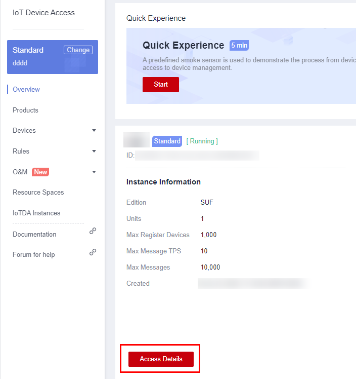

* View and save the MQTT device access address.

   

* On the IoTDA console, choose **Products** in the navigation pane, and click **Create Product** in the upper right corner. On the displayed page, specify the product name, protocol, data type, manufacturer, industry, and device type, and click **OK**.

   - Select the **MQTT** protocol.

   - Select the **JSON** data format.

   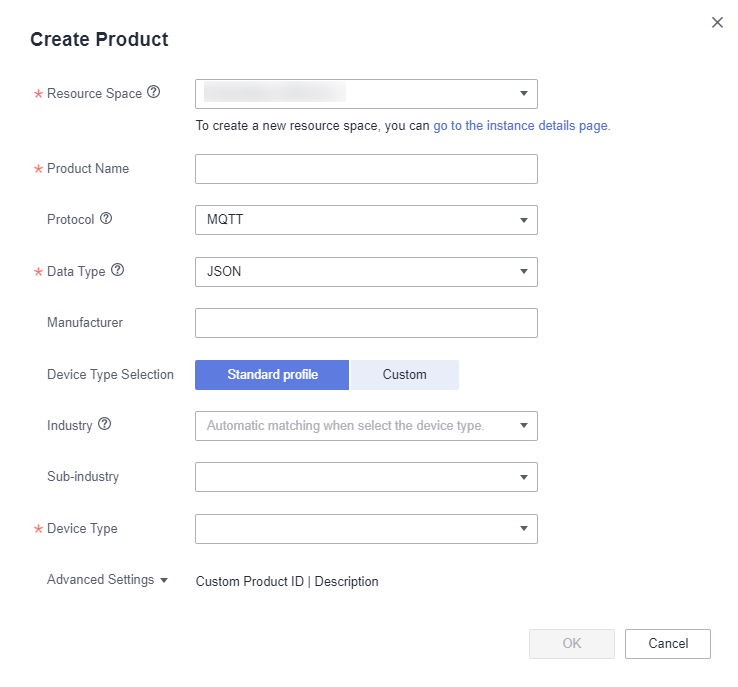

* After the product is created, click **View** to access its details. On the **Model Definition** page, click **Import from Local** to upload the smoke detector product model [smokeDetector](https://iot-developer.obs.cn-north-4.myhuaweicloud.com:443/smokeDetector.zip).
  The following figure shows the generated product model.

  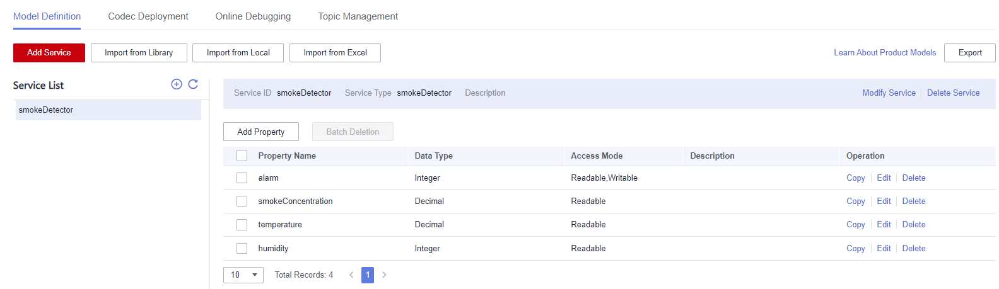

* In the navigation pane, choose **Devices** > **All Devices**. In the upper right corner, click **Individual Register**. On the page displayed, set device registration parameters and click **OK**.

   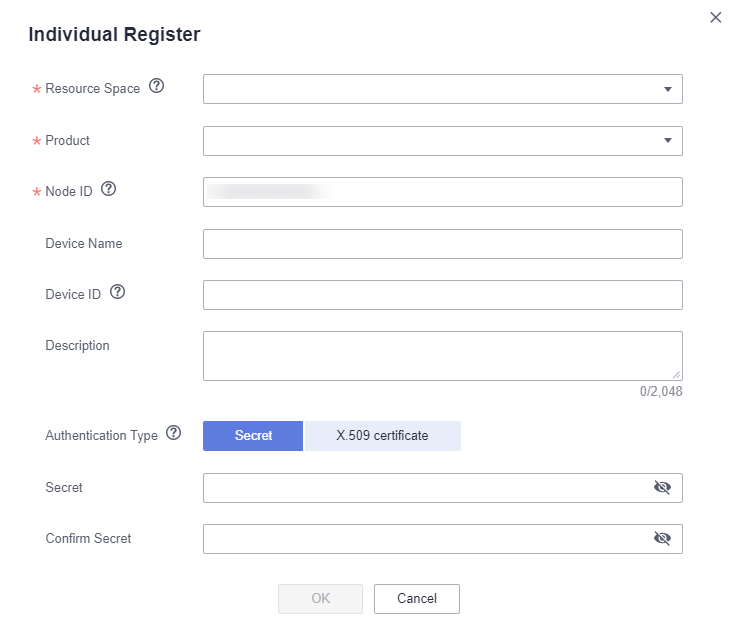

* After the device is registered, save the node ID, device ID, and secret.

## 4.2 Online Debugging

In the navigation pane, choose **O&M** > **Online Debug**. The **Online Debugging** page is displayed.
Command delivery and message tracing are available.

*  Click **Select Device** in the upper right corner to select a registered device.

*  Click **IoT Platform**. The message tracing result is displayed.

*  Click **Send** in the lower right corner to send the command to the device.

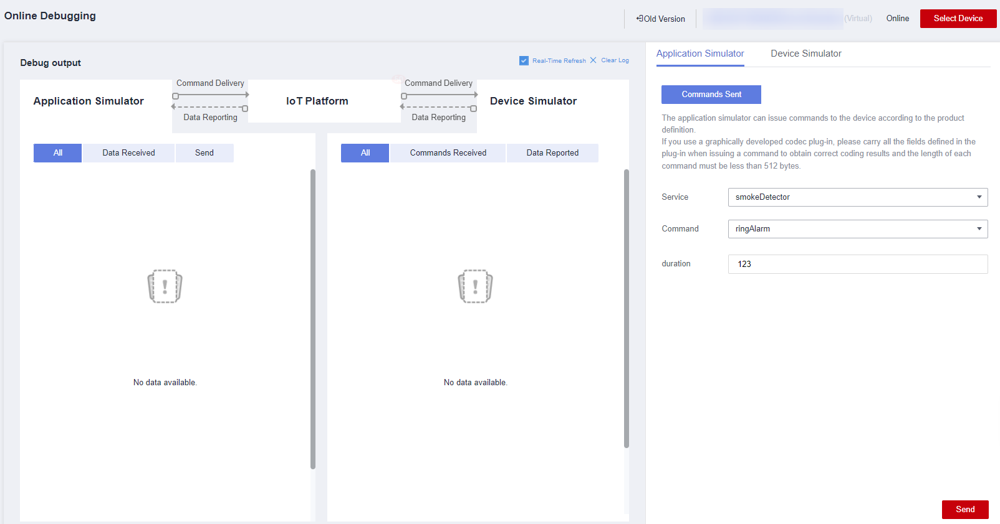

## 4.3 Device Initialization

* Create a device.

   Secret authentication and certificate authentication are available for device access.

   * If you use port 1883 and secret authentication for device access, write the obtained device ID and secret.

   ```
       server_uri = "access address"   # Change the access address to the one you saved.
       port = 1883
       device_id = "your device id"
       secret = "your device secret"

       connect_auth_info = ConnectAuthInfo()
       connect_auth_info.server_uri = server_uri
       connect_auth_info.port = port
       connect_auth_info.id = device_id
       connect_auth_info.secret = secret
       client_conf = ClientConf(connect_auth_info)

       device = IotDevice(client_conf)
   ```

   * If you use port 8883 and secret authentication for device access (recommended, all the demo access the platform by this method), write the obtained device ID, secret, and preset CA certificate.
     Preset certificate: **/iot_device_demo/resources/root.pem**

   ```
       server_uri = "access address"   # Change the access address to the one you saved.
       port = 8883
       device_id = "your device id"
       secret = "your device secret"
       # CA certificate of the IoT platform, used for server authentication.
       iot_ca_cert_path = "./resources/root.pem"

       connect_auth_info = ConnectAuthInfo()
       connect_auth_info.server_uri = server_uri
       connect_auth_info.port = port
       connect_auth_info.id = device_id
       connect_auth_info.secret = secret
       connect_auth_info.iot_cert_path = iot_ca_cert_path
       client_conf = ClientConf(connect_auth_info)

       device = IotDevice(client_conf)
   ```

    * If you use port 8883 and access the platform through X509 certificate authentication, write the obtained device ID, certificate information and pre-made CA certificate. Preset certificate: **/iot_device_demo/resources/root.pem**. For more X.509 certificate access, please refer to [X509 Certificate Access](https://support.huaweicloud.com/bestpractice-iothub/iot_bp_0077.html)
     

   ```
       server_uri = "access address"   # Change the access address to the one you saved.
       port = 8883
       device_id = "your device id"
       secret = "your device secret"
       # CA certificate of the IoT platform, used for server authentication.
       iot_ca_cert_path = "./resources/root.pem"
       cert_path = "your x.509 device cert path"
       key_path = "your x.509 device cert key path"

       connect_auth_info = ConnectAuthInfo()
       connect_auth_info.server_uri = server_uri
       connect_auth_info.port = port
       connect_auth_info.id = device_id
       connect_auth_info.auth_type = ConnectAuthInfo.X509_AUTH
       connect_auth_info.cert_path = cert_path
       connect_auth_info.key_path = key_path
       connect_auth_info.iot_cert_path = iot_ca_cert_path
       connect_auth_info.bs_mode = ConnectAuthInfo.BS_MODE_DIRECT_CONNECT

       client_conf = ClientConf(connect_auth_info)

       device = IotDevice(client_conf)
   ```
* Call the **init** function to connect the device to the platform. This is a blocking function and it returns **0** if the device and the platform are connected.

   ```
        if device.connect() != 0:
            return
   ```

* After the connection is established, the device starts to communicate with the platform. Call the **get_client** method of the **IotDevice** class to obtain the device client, which provides communication APIs related to messages, properties, and commands.
  Example:
   ```
        device.get_client().set_command_listener(...)
        device.get_client().report_device_message(...)
   ```

*  For details about the **IotDevice** class, see **/iot_device_sdk_python/iot_device.py**.

If the connection is successful, the following information is displayed in the **Message Tracing** area on the **Online Debugging** page:

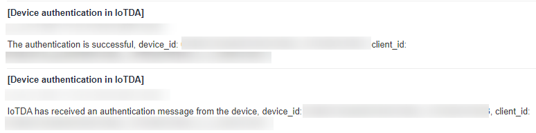

Run logs:


## 4.4 Command Delivery

**/iot_device_demo/command/command_sample.py** is an example of processing commands delivered by the IoT platform. You can set a command listener to receive commands delivered by the platform. The callback needs to process the commands and report responses.

The **CommandSampleListener** class in the following code inherits the **CommandListener** class and implements the **on_command** method. Set the **CommandSampleListener** instance to the command listener, which is:

```
device.get_client().set_command_listener(CommandSampleListener(device))
```

When receiving a command, the device automatically calls the **on_command** method in the listener.
The command content is printed in the **on_command** method, and the response is returned to the platform.

```
class CommandSampleListener(CommandListener):
    def __init__(self, iot_device: IotDevice):
        """ Pass an IotDevice instance. """
        self.device = iot_device

    def on_command(self, request_id, service_id, command_name, paras):
        logger.info('on_command requestId: ' + request_id)
        # Process commands.
        logger.info('begin to handle command')

        """ code here """
        logger.info(str(paras))

        # Command response
        command_rsp = CommandRsp()
        command_rsp.result_code = 0
        command_rsp.response_name = command_name
        command_rsp.paras = {"content": "Hello Huawei"}
        self.device.get_client().response_command(request_id, command_rsp)


def run():
    
    < create device code here ... >
    
    # Set a listener.
    device.get_client().set_command_listener(CommandSampleListener(device))
    
    if device.connect() != 0:
        logger.error('init failed')
        return

    while True:
        time.sleep(5)
```

Run the **run** function to deliver a command to the device on the **Online Debugging** page, The code output is as follows:

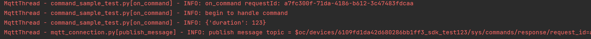

In addition, the device response to the command is displayed in the **Message Tracing** area of the **Online Debugging** page.

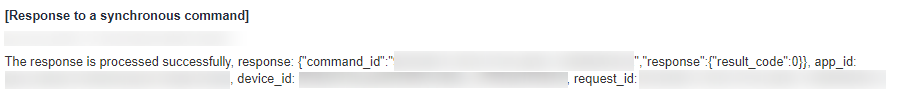

## 4.5 Platform Message Delivery/Device Message Reporting


Message delivery is the process in which the platform delivers messages to a device. Message reporting is the process in which a device reports messages to the platform. for more information about message delivery, please refer to [Device Message Document](https://support.huaweicloud.com/intl/en-us/usermanual-iothub/iot_01_0332.html)

### 4.5.1 message report
**/iot_device_demo/message/message_sample.py** shows an example of message reporting.

```python
    """ create device code here """

    default_publish_listener = DefaultPublishActionListener()
    device_message = DeviceMessage()
    device_message.content = "Hello Huawei"

    device_message2 = DeviceMessage()
    device_message2.content = "Custom topic Message"

    device_message3 = DeviceMessage()
    device_message3.content = "Custom Policy topic Message"
    # 定时上报消息
    while True:
        # Report messages through the platform’s default topic
        device.get_client().report_device_message(device_message,
                                                  default_publish_listener)
        time.sleep(1)

        payload = json.dumps(device_message2.to_dict())
        # Report messages through platform custom topics
        device.get_client().publish_raw_message(RawMessage(custom_topic, payload, 1), default_publish_listener)
        time.sleep(1)

        payload = json.dumps(device_message3.to_dict())
        # Report messages through topics in platform custom policies
        device.get_client().publish_raw_message(RawMessage(custom_policy_topic, payload, 1), default_publish_listener)
        time.sleep(5)
```

The **report_device_message** method reports the message to the platform. If the message is sent, the following information is displayed on the **Online Debugging** page.

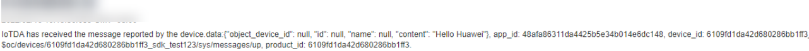

### 4.5.2 message delivery
/iot_device_demo/message/message_delivery_sample.py shows an example of message delivery.
```python
class CustomConnectListener(ConnectListener):

    def __init__(self, iot_device: IotDevice):
        self.device = iot_device

    def connection_lost(self, cause: str):
        """
        Reason for connection loss

        Args:
            cause:   Reason for connection loss
        """
        logger.warning("connection lost. cause: " + cause)
        logger.warning("you can define reconnect in this method.")

    # Customized topic subscriptions need to be placed after the link is successfully established to prevent the topic from not being subscribed after disconnection and reconnection.
    def connect_complete(self, reconnect: bool, server_uri: str):
        """
        Notification of successful connection. If the link is disconnected and reconnected, the topic will be resubscribed if the reconnection is successful.

        Args:
            reconnect:   Is it a reconnection?
            server_uri:  Server address
        """
        # custom topic starts with $oc/devices/{device_id}/user/
        custom_topic = "$oc/devices/{device_id}/user/{topic}"
        # custom policy topic， For example：testdevicetopic
        custom_policy_topic = "{custom_topic}"
        # Use a custom topic to set up a listener to receive platform delivery messages
        self.device.get_client().subscribe_topic(custom_topic, 1, RawDeviceMsgListener())
        # Use a custom policy topic to set up a listener to receive platform delivery messages.
        self.device.get_client().subscribe_topic(custom_policy_topic, 1, RawDeviceMsgListener())
        logger.info("connect success. server uri is " + server_uri)
class RawDeviceMsgListener(RawDeviceMessageListener):
    def on_raw_device_message(self, message: RawDeviceMessage):
        """
        Process device messages sent by the platform
        :param message:     deice message content
        """
        device_msg = message.to_device_message()
        if device_msg:
            print("on_device_message got system format:", message.payload)
        else:
            print("on_device_message:", message.payload)

        """ code here """
        pass


def run():
    < create device code here ... >

    # Set up a listener to receive platform delivery messages
    device.get_client().set_raw_device_msg_listener(RawDeviceMsgListener())
    device.get_client().add_connect_listener(CustomConnectListener(device))
    if device.connect() != 0:
        logger.error("init failed")
        return
```

In the above code, subscribe_topic can subscribe to messages delivered by a custom topic. If you do not use messages delivered by a custom topic, use the platform's default topic to deliver messages. After executing the run function, you can use the platform to deliver messages. The code will produce the following output:
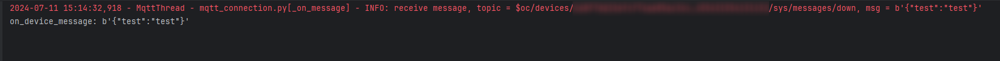


## 4.6 Property Reporting/Configuration

A device can report current property values to the platform. Device properties can be configured on the platform.
**/iot_device_demo/device/properties_sample.py** shows an example of property reporting/configuration.

### 4.6.1 Property reporting
Devices report property data in the format defined in the product model to the platform. The platform will assign the reported data to the device shadow data.

   ```python
   def run():
       < create device code here ... >
   
       if device.connect() != 0:
           logger.error('init failed')
           return
   
       service_property = ServiceProperty()
       service_property.service_id = 'smokeDetector'
       service_property.properties = {'alarm': 10, 'smokeConcentration': 36, 'temperature': 64, 'humidity': 32}
       services = [service_property.to_dict()]
   
       while True:
           device.get_client().report_properties(services, DefaultPublishActionListener())
           time.sleep(5)
   ```

The above code will periodically report the four properties **alarm**, **smokeConcentration**, **temperature**, and **humidity** . If properties are reported, the following information is displayed on the **Online Debugging** page.

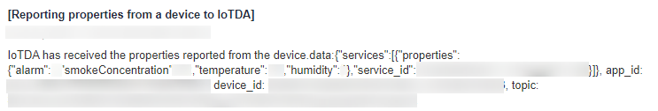

In the navigation pane, choose **Devices** > **All Devices**, select the registered device, and click the **Device Shadow** tab to view the reported property values.

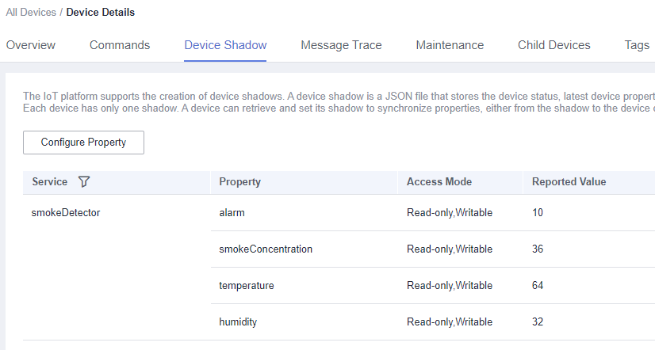

### 4.6.2 Setting Device Properties on the Platform
If you set the **PropertySampleListener** instance as a property listener by running the following command:

```
device.get_client().set_properties_listener(PropertySampleListener(device))
```

When receiving a property read/write request, the device automatically calls the **on_property_set** or **on_property_get** method in the listener.

**on_property_set** writes properties. **on_property_get** reads properties.

In most scenarios, you can directly read the device shadow on the platform, so **on_property_get** does not need to be implemented.

To read device properties in real time, implement this method.

The configured properties are printed in the **on_property_set** method, and the response is returned to the platform.

```python
class PropertySampleListener(PropertyListener):
    def __init__(self, iot_device: IotDevice):
        """ Pass an IotDevice instance. """
        self.device = iot_device

    def on_property_set(self, request_id, services: [ServiceProperty]):
        """ Traverse services. """
        for service_property in services:
            logger.info("on_property_set, service_id:" + service_property.service_id)
            """ Traverse properties. """
            for property_name in service_property.properties:
                logger.info('set property name:' + property_name)
                logger.info("set property value:" + str(service_property.properties[property_name]))
        self.device.get_client().respond_properties_set(request_id, iot_result.SUCCESS.to_dict())

    def on_property_get(self, request_id, service_id):
        pass


def run():
    < create device code here ... >
    
    device.get_client().set_properties_listener(PropertySampleListener(device))

    if device.connect() != 0:
        return
```

On the **Device Shadow** tab page, click **Configure Property** to set the desired property value.
If the desired value you set is different from the value reported by the device, the platform automatically sends the desired value to the device when it goes online. (This is the process of setting a property on the platform.)

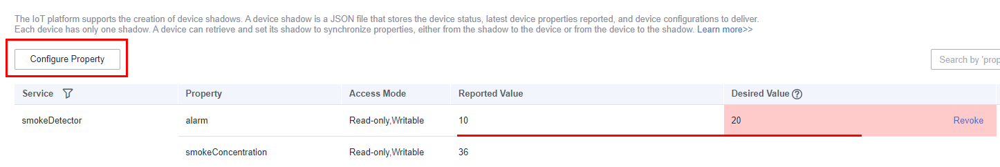

Run the preceding **run** function. The following information is displayed.

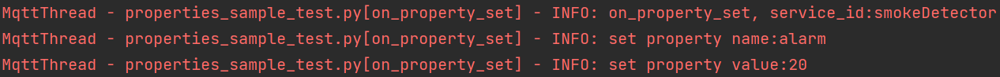

## 4.7 Device Shadow

This is used by device to get shadow data. A device can obtain device shadow data from the platform to synchronize (modify) device properties.

**/iot_device_demo/device/device_shadow_sample.py** shows an example of obtaining device shadow data from the platform.

* A device obtains device shadow data from the platform.

   ```python
    # Receiving responses from the platform
    device.get_client().set_device_shadow_listener(DeviceShadowSampleListener())

    if device.connect() != 0:
        logger.error('init failed')
        return

    # Obtaining device shadow data
    request_id = str(uuid.uuid1())
    device.get_client().get_device_shadow(request_id, {'service_id': 'smokeDetector'}, None)
   ```

* A device receives shadow data returned by the platform.

   ```python
   class DeviceShadowSampleListener(DeviceShadowListener):
    """
    An example of implementing a shadow data delivery listener
    """
    def on_shadow_get(self, request_id: str, object_device_id: str, shadow: List[ShadowData]):
        """
        Process device shadow data issued by the platform
        :param request_id: request id
        :param object_device_id: device id
        :param shadow:     dict
        """
        logger.info("on_shadow_get request_id: " + request_id)
        logger.info("on_shadow_get device_id: " + object_device_id)
        print("shadow service_id: " + shadow[0].service_id)
        print("shadow desired properties: " + str(shadow[0].desired.properties))
        print("shadow reported properties: " + str(shadow[0].reported.properties))
   ```

## 4.8 Profile-Oriented Programming

You can use the profile capabilities provided by the SDK to define device services. The SDK can automatically communicate with the platform to synchronize properties and call commands. Compared with directly calling client APIs to communicate with the platform, profile-oriented programming simplifies device-side code. In this way, device-side code can focus on services and does not need to implement communications with the platform. **/iot_device_demo/device/smoke_detector.py** shows an example of profile-oriented programming.

Define a smoke detector service class, which is inherited from the **AbstractService** class.

```python
class SmokeDetectorService(AbstractService)
```

Define service properties, which must be consistent with those defined in the product model.
*  The value of **prop_name** must be the same as that of the model. **writeable** indicates whether the property can be written. **field_name** indicates the variable name. **val** indicates the property value.

```python
smoke_alarm = Property(val=20, field_name="smoke_alarm", prop_name="alarm", writeable=True)
concentration = Property(val=float(32.0), field_name="concentration", prop_name="smokeConcentration", writeable=False)
humidity = Property(val=64, field_name="humidity", prop_name="humidity", writeable=False)
temperature = Property(val=float(36.0), field_name="temperature", prop_name="temperature", writeable=False)
```

Define the methods for reading and writing properties.
*  **get_***xxx* is the read method and is called by the SDK when properties are queried by the platform or reported.
*  **set_***xxx* is the write method and is called by the SDK when properties are modified on the platform. If properties are read-only, leave the **set_***xxx* method not implemented.

```python
    # Naming rules of the **get**/**set** APIs: **get**_*VariableName* or **set**_*VariableName*. If the setting is valid, the SDK automatically calls these APIs.
    def get_humidity(self):
        # Simulate the action of reading data from the sensor.
        self.humidity.val = 32
        return self.humidity.val

    def set_humidity(self, humidity):
        # You do not need to implement this method for read-only fields.
        pass

    def get_temperature(self):
        # Simulate the action of reading data from the sensor.
        self.temperature.val = 64
        return self.temperature.val

    def set_temperature(self, temperature):
        # You do not need to implement this method for read-only fields.
        pass

    def get_concentration(self):
        # Simulate the action of reading data from the sensor.
        self.concentration.val = 36
        return self.concentration.val

    def set_concentration(self, concentration):
        # You do not need to implement this method for read-only fields.
        pass

    def get_smoke_alarm(self):
        return self.smoke_alarm.val

    def set_smoke_alarm(self, smoke_alarm: int):
        self.smoke_alarm.val = smoke_alarm
        if smoke_alarm == 10:
            self._logger.info("set alarm:" + str(smoke_alarm))
            self._logger.info("alarm is clear by app")
```

Define the service command. The type of input parameters and return values of the command cannot be changed. Otherwise, a runtime error occurs.

```python
    def alarm(self, paras: dict):
        duration = paras.get("duration")
        self._logger.info("ringAlarm duration = " + str(duration))
        command_rsp = CommandRsp()
        command_rsp.result_code = command_rsp.SUCCESS()
        return command_rsp
```

The service is defined. For details about the code, see the **SmokeDetectorService** class in **/iot_device_demo/device/smoke_detector.py**. Then, create a device, register the smoke detector service, and initialize the device. When the device is connected. The smoke detector service enables scheduled property reporting.

```python
class SmokeDetector:
    def __init__(self, server_uri, port, device_id, secret):
        self.server_uri = server_uri
        self.port = port
        self.device_id = device_id
        self.secret = secret

    def start(self):
        """ Create a device. """
        < create device code here ... >
        
        """ Add smoke detector service. """
        smoke_detector_service = SmokeDetectorService()
        device.add_service("smokeDetector", smoke_detector_service)
        """ Connect the device to the platform. """
        if device.connect() != 0:
            return
        
        """ Enable scheduled property reporting. """
        smoke_detector_service.enable_auto_report(5)

        """ End scheduled reporting in 20s. """
        time.sleep(20)
        smoke_detector_service.disable_auto_report()
```

If properties are reported, the following information is displayed on the **Online Debugging** page:

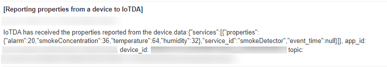

On the **Online Debugging** page, send a command to the device. The profile automatically calls the **alarm** method of the **SmokeDetectorService** class. The output is as follows:


## 4.9 OTA upgrade
**/iot_device_demo/ota/ota_sample.py** shows an example of performing OTA upgrade. The code is as follows:

```python
def run():
   < create device code here ... >

    """ OTA listener settings """
    ota_service: OTAService = device.get_ota_service()
    ota_service_listener = OTASampleListener(ota_service)
    ota_service.set_ota_listener(ota_service_listener)

    if device.connect() != 0:
        return
```

**OTAService** is a service defined by the system and can be obtained using the **get_ota_service** method.
You need to implement the OTA listener. The **OTASampleListener** class in **/iot_device_demo/ota/ota_sample.py** is an example of listener implementation. The **OTASampleListener** class inherits the **OTAListener** class and must implement the following methods:
*  **on_query_version**: receives a version query notification. This method needs to be implemented to return the current version number to the platform.
*  **on_receive_package_info**: receives the new version notification. This method needs to be implemented to download and install a package for upgrade.

### 4.9.1 How to perform OTA upgrade

1. For details about how to upgrade firmware, see [Firmware Upgrades](https://support.huaweicloud.com/intl/en-us/usermanual-iothub/iot_01_0027.html).

2. For details about how to upgrade software, see [Software Upgrades](https://support.huaweicloud.com/intl/en-us/usermanual-iothub/iot_01_0047.html).

## 4.10 File upload/download

**/iot_device_demo/filemanage/file_sample.py** shows an example of uploading and downloading files.

```python
def run():
    < create device code here ... >

    """ Set the file management listener. """
    file_manager: FileManagerService = device.get_file_manager_service()
    file_manager_listener = FileManagerSampleListener()
    file_manager.set_listener(file_manager_listener)

    if device.connect() != 0:
        logger.error('init failed')
        return

    """ File upload """
    upload_file_path = os.path.dirname(__file__) + r'/download/upload_test.txt'
    file_name = "upload_test.txt"
    file_manager.get_upload_url(upload_file_path=upload_file_path, file_name=file_name)

    # After 10 seconds, download the uploaded **upload_test.txt** file and save it to **download.txt**.
    time.sleep(10)

    """ File download """
    download_file_path = os.path.dirname(__file__) + r'/download/download.txt'
    file_manager.get_download_url(download_file_path=download_file_path, file_name=file_name)
```

**FileManagerService** is a service defined by the system and can be obtained using the **get_file_manager_service** method of the device. You need to implement the **FileManagerService** listener. The **FileManagerSampleListener** class in **/iot_device_demo/filemanage/file_sample.py** is an example of listener implementation. The **FileManagerSampleListener** class inherits the **FileManagerListener** class and must implement the following methods:
*  **on_upload_url**: receives the file upload URL delivered by the platform.
*  **on_download_url**: receives the file download URL delivered by the platform.

For details about the file upload/download process, see [File Uploads](https://support.huaweicloud.com/intl/en-us/usermanual-iothub/iot_01_0033.html).

* Configure OBS storage on the console.

   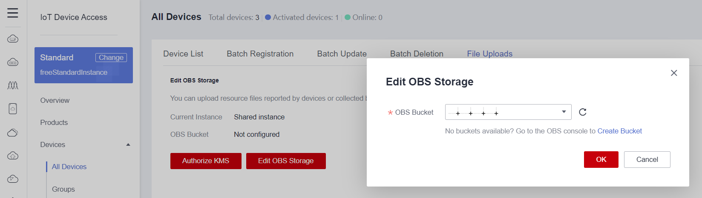

* Preset the file to be uploaded. In the preceding example, the file to be uploaded is **/iot_device_demo/filemanage/download/upload_test.txt**.
   Download the uploaded **upload_test.txt** file to **/iot_device_demo/filemanage/download/download.txt**.

* Run the preceding commands to view the storage result in OBS.

   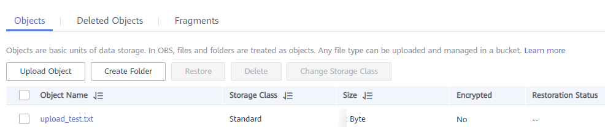

## 4.11 Device time synchronization

**/iot_device_demo/device/ntp_sample.py** shows an example of synchronizing device time.

```python
def run():
   < create device code here ... >

    """ Set the time synchronization service. """
    time_sync_service: TimeSyncService = device.get_time_sync_service()
    time_sync_listener = TimeSyncSampleListener()
    time_sync_service.set_listener(time_sync_listener)

    if device.connect() != 0:
        logger.error('init failed')
        return

    # Request for time synchronization
    time_sync_service.request_time_sync()
```

**TimeSyncService** is a service defined by the system and can be obtained using the **get_time_sync_service** method. You need to implement the **TimeSyncListener** listener. The **TimeSyncSampleListener** class in **/iot_device_demo/device/ntp_sample.py** is an example of listener implementation. The **TimeSyncSampleListener** class inherits the **TimeSyncListener** class and must implement the following method:
*  **on_time_sync_response**: time synchronization response. Assume that the time when the device receives the response is **device_recv_time**. The device calculates the accurate time as follows:
        (server_recv_time + server_send_time + device_recv_time - device_send_time) / 2

## 4.12 Gateway and sub-device management
For details, see [Gateways and Child Devices](https://support.huaweicloud.com/intl/en-us/usermanual-iothub/iot_01_0052.html).

The demo code for gateway and child device management is stored in **/iot_gateway_demo**. This demo demonstrates how to use a gateway to connect TCP devices to the platform. Only an MQTT connection is established between the gateway and platform. Devices communicate with the platform using the gateway information.

This demo contains two executable .py files:
**/iot_gateway_demo/string_tcp_server.py** (gateway-related code) and **/iot_gateway_demo/tcp_device.py** (TCP device-related code).


This demo demonstrates that:
1. The gateway synchronizes the child device list. When the gateway is offline, the platform cannot notify the gateway of child device addition and deletion in a timely manner.
   When the gateway goes online, the platform notifies the gateway of child device addition and deletion.
2. The gateway updates the child device status. The gateway notifies the platform that the child device status is "ONLINE".
3. The child device reports a message to IoT platform through the gateway.
4. The platform delivers a command to the child device.
5. The gateway sends a request for adding/deleting child devices.
6. Gateway add/delete sub-device request

### 4.12.1 How to run

Run **string_tcp_server.py**. The device ID, device secret, and product ID of the gateway need to be entered. The gateway establishes a connection with the platform and synchronizes the child device list.

Run **tcp_device.py**. The child device ID needs to be entered. Enter any string in the CLI, for example, **go online**. This is the first message sent by the child device to the gateway. If the child device has been registered with the platform, the gateway instructs the platform to set the child device status to online.
If the child device is not registered with the platform, the gateway registers the child device with the platform, as shown in the following example.

Run **string_tcp_server.py**, enter the child device ID (not registered on the platform) in **tcp_device.py**, run **tcp_device.py**, and enter a string in the CLI.

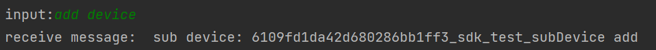

The gateway sends a request to the platform to add a child device. The created child device is displayed on the platform.

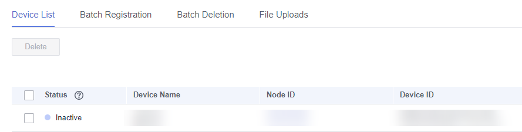After the child device is created, enter a string in the CLI. The gateway instructs the platform to update the child device status to "ONLINE".


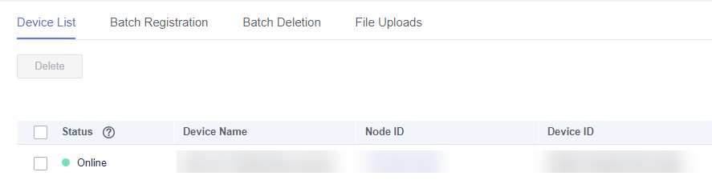

After the child device status changes to online on the platform, enter a string in the CLI. The gateway reports the message to the platform.

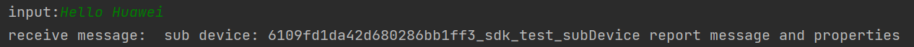

If you enter **gtwdel**, the gateway sends a request to the platform to delete the child device.


The child device is deleted from the platform.

## 4.13 Report device information

**/iot_device_demo/device/report_device_info_sample.py** shows an example of reporting device information.
Device information includes the firmware version, software version, and SDK version. It should be noted that if connect_auth_info.auto_report_device_info = True, when a device establishes a connection with the platform for the first time, the SDK automatically reports the device information that contains only the SDK version.

```python
def run():
    < create device code here ... >

    if device.connect() != 0:
        logger.error('init failed')
        return

    """ Report device information. """
    device_info = DeviceBaseInfo()
    device_info.fw_version = "v1.0"
    device_info.sw_version = "v1.0"
    device.get_client().report_device_info(device_info)
```

## 4.14 Device Log Reporting

The SDK automatically reports device logs in either of the following scenarios. In other scenarios, you need to report logs manually.

1. When a device establishes a connection with the platform for the first time, the SDK automatically reports the device log. Example:

    ```python
    {
        "object_device_id": "6109fd1da42d680286bb1ff3_123456",
        "services": [{
         "service_id": "$log", 
         "event_type": "log_report", 
         "event_time": "2021-09-11T10:36:18Z", 
         "event_id": "", 
         "paras": {
             "timestamp": "1631327778381", 
             "type": "DEVICE_STATUS", 
             "content": "connect complete, the uri is iot-mqtts.cn-north-5.myhuaweicloud.com"
         }
        }]
    }
    ```

2. After the device reconnects to the platform, the SDK automatically reports two device logs.
   One records the timestamp when the device reconnects to the platform, and the other records the timestamp when the device is disconnected from the platform. The log format is the same as that in the preceding example.

## 4.15 Client-side rules
Create a client-side rule in the console:
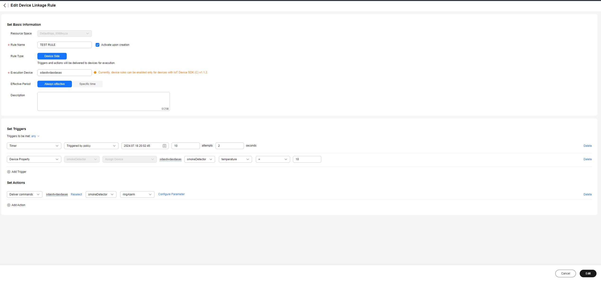

An example of a device-side rule is implemented in /iot_device_demo/rule/device_rule_sample.py. You can enable end-side rules through the following parameters
```python
connect_auth_info.enable_rule_manage = True
```
Implement the CommandListener class through CommandSampleListener and override the on_command method in it. Set an instance of CommandSampleListener as the command listener, that is:

```python
device.get_client().set_command_listener(CommandSampleListener(device))
```

When the rule is triggered, the device will automatically call the on_command method in the listener when it receives the command.
The example prints the content of the command in the on_command method. Customers can customize the content to implement a series of operations on the device.

```python
class CommandSampleListener(CommandListener):
    def __init__(self, iot_device: IotDevice):
        """ Pass in an IotDevice instance"""
        self.device = iot_device

    def on_command(self, request_id, service_id, command_name, paras):
        logger.info('on_command requestId: ' + request_id)
        # Processing commands
        logger.info('begin to handle command')

        """ code here """
        logger.info(str(paras))

        # Command response
        command_rsp = CommandRsp()
        command_rsp.result_code = 0
        command_rsp.response_name = command_name
        command_rsp.paras = {"content": "Hello Huawei"}
        self.device.get_client().response_command(request_id, command_rsp)


def run():
    
    &lt; create device code here ... &gt;
    
    # Set up listener
    device.get_client().set_command_listener(CommandSampleListener(device))
    
    if device.connect() != 0:
        logger.error('init failed')
        return

    logger.info("begin to report properties")
    # Set properties according to product model
    service_property = ServiceProperty()
    service_property.service_id = "smokeDetetor"
    service_property.properties = {"temperature": 10}
    #Assemble into list form
    services = [service_property]

    #Report device attributes
    device.get_client().report_properties(services)
    while True:
        time.sleep(5)
```

Executing the run function, the code will produce the following output:
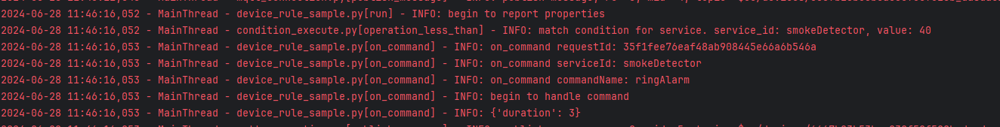
If the end-side rule switch is not turned on on the device side, the code will produce the following output:
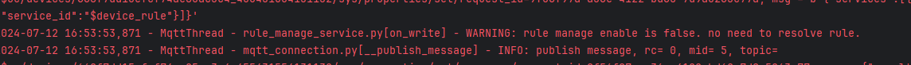

If you want to use a custom method to process the actions of end-side rules, an example of custom end-side rules is implemented in /iot_device_demo/rule/custom_device_rule_sample.py.
The ActionHandlerListener class in the code below inherits the ActionHandler class and implements the handle_rule_action method.
Set an instance of ActionHandlerListener as the command listener, that is:

```
device.get_client().set_rule_action_handler(ActionHandlerListener())
```

When the rule is triggered, the device will automatically call the on_command method in the listener when it receives the command.
The example implements some custom operations in the handle_rule_action method. For example the following output:


## 4.16 Device bootstrap
Create a distribution policy in the console with the keyword xxx:
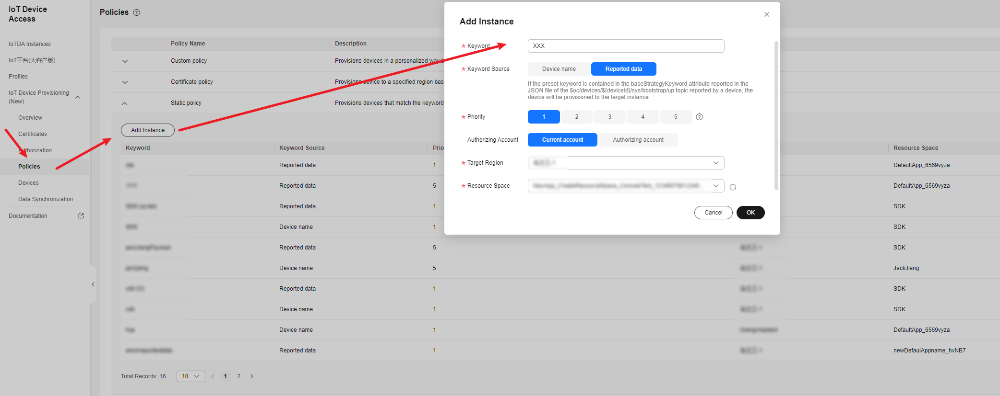

Create a device in the console, select static policy as the policy type, and select the product in the same area as the created policy:
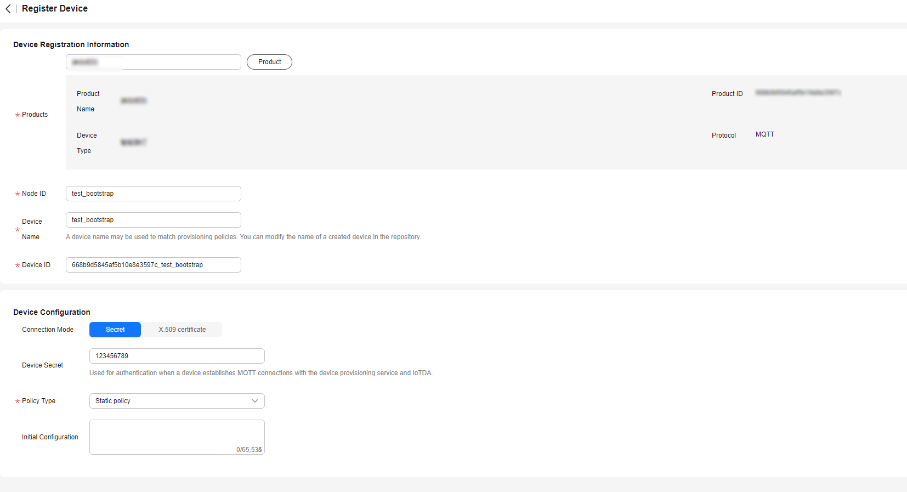

An example of using static policy to allocate devices is implemented in /iot_device_demo/bootstrap/bootstrap_sample.py. Change server_uri to the issued address, select the device ID and password just created, and select the device and password.
The value xxx of baseStrategyKeyword in connect_auth_info.bs_message is the keyword of the created static policy. After filling in the correct certificate information.

```python
def run():
    server_uri = "iot-bs.cn-north-4.myhuaweicloud.com"
    port = 8883
    device_id = "your device id"
    secret = "your device secret"
    iot_cert_file_path = "iot cert path"
    bs_cert_path = "./resources/root.pem"

    connect_auth_info = ConnectAuthInfo()
    connect_auth_info.server_uri = server_uri
    connect_auth_info.port = port
    connect_auth_info.id = device_id
    connect_auth_info.secret = secret
    connect_auth_info.check_timestamp = "0"
    connect_auth_info.iot_cert_path = iot_cert_file_path
    connect_auth_info.bs_cert_path = bs_cert_path
    connect_auth_info.bs_message = "{\"baseStrategyKeyword\":\"xxx\"}"

    client_conf = ClientConf(connect_auth_info)

    device = IotDevice(client_conf)
    if device.connect() != 0:
        logger.error("init failed")
        return

    logger.info("begin report message")
    device_message = DeviceMessage()
    device_message.content = "Hello Huawei"
    #Report messages regularly
    while True:
        device.get_client().report_device_message(device_message)
        time.sleep(10)
```
Executing the run function, the code will produce the following output:
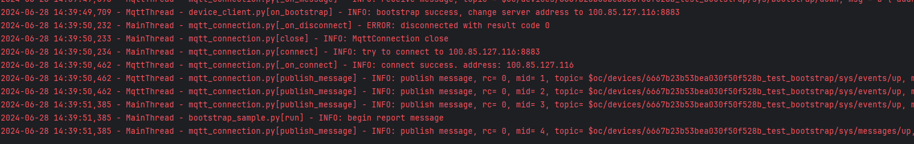
After the device is successfully distributed, a server_info.json file will be generated in /iot_device_demo. The file stores the address of iotda after the successful distribution and the key information of the distributed device (generated only when the registration group key is distributed), to be used for other devices. When distributing, the file needs to be deleted.

In addition to /iot_device_demo/bootstrap/bootstrap_sample.py, there is also bootstrap_cert_sample.py in /iot_device_demo that uses static policy certificates for issuance, bootstrap_groups_sample.py
Use static policies to allocate registration group devices, and bootstrap_groups_cert_sample.py uses certificate policies to allocate registration group devices. For detailed parameters, please refer to the following link:
[Device access provisioning example](https://support.huaweicloud.com/qs-iotps/iot_03_0006.html)

## 4.17 Disconnection and reconnection
In iot_device_demo/device/device_reconnec_sample.py, we demonstrate the function of disconnection and reconnection.
```python
class CustomConnectListener(ConnectListener):

    def __init__(self, iot_device: IotDevice):
        """ Pass in an IotDevice instance"""
        self.device = iot_device

    def connection_lost(self, cause: str):
        """
        Lost connection notification

        Args:
            cause: Reason for connection loss
        """
        logger.warning("connection lost. cause: " + cause)
        logger.warning("you can define reconnect in this method.")

    def connect_complete(self, reconnect: bool, server_uri: str):
        """
        Successful connection notification

        Args:
            reconnect: whether to reconnect (currently this parameter has no effect)
            server_uri: server address
        """
        logger.info("connect success. server uri is " + server_uri)


def run():
    server_uri = "iotda server uri"
    port = 1883
    device_id = "your device id"
    secret = "password"

    connect_auth_info = ConnectAuthInfo()
    connect_auth_info.server_uri = server_uri
    connect_auth_info.port = port
    connect_auth_info.id = device_id
    connect_auth_info.secret = secret
    connect_auth_info.check_timestamp = "0"
    connect_auth_info.bs_mode = ConnectAuthInfo.BS_MODE_DIRECT_CONNECT
    # Whether to enable disconnection reconnection
    connect_auth_info.reconnect_on_failure = True
    #Minimum backoff time for disconnection and reconnection
    connect_auth_info.min_backoff = 1 * 1000
    #Maximum backoff time for disconnection and reconnection
    connect_auth_info.max_backoff = 30 * 1000
    # Maximum number of cached messages after disconnection
    connect_auth_info.max_buffer_message = 100

    client_conf = ClientConf(connect_auth_info)

    device = IotDevice(client_conf)
    if device.connect() != 0:
        logger.error("init failed")
        return

    device.get_client().add_connect_listener(CustomConnectListener(device))
    logger.info("begin report message")
    device_message = DeviceMessage()
    device_message.content = "Hello Huawei"
    #Report messages regularly
    while True:
        device.get_client().report_device_message(device_message, DefaultPublishActionListener())
        time.sleep(10)
```
You can enable disconnection reconnection by setting connect_auth_info.reconnect_on_failure=True. After setting it to True, you can configure the disconnection reconnection interval and the maximum backoff time by setting the following parameters. The specific logic of disconnection and reconnection can be viewed in the iot_device_sdk_python.transport.mqtt.mqtt_connection.MqttConnection.connect() function.
```python
connect_auth_info.min_backoff = 1 * 1000
connect_auth_info.max_backoff = 30 * 1000
```
You can also set it to False to disable reconnection. Then implement your own disconnection and reconnection logic in a customized way. SDK provides you with the ConnectListener interface. You can implement the connection_lost and connect_complete functions in this interface. SDK will notify you when the link is successfully established and the connection is disconnected. You can implement your own link disconnection and reconnection logic in the function, and Prefab this interface into the SDK through the following method:
```python
device.get_client().add_connect_listener(CustomConnectListener(device))
```
SDK also provides the max_buffer_message parameter. If you set this parameter, when the SDK is disconnected from the platform, the messages you report will be cached in memory. The maximum number of cached messages is the value of max_buffer_message. If the cached messages exceed this value, The data that enters the cache earliest will be removed. When the link is established with the platform again, the SDK will re-publish the messages in the cache to the platform.
```python
connect_auth_info.max_buffer_message = 100
```

#5.0 Open Source License
- Follow the BSD-3 open source license agreement

# 6.0 interface documentation
Refer to [Device Access Interface Documentation](./IoT-Device-SDK-Python-API Documentation.pdf)

# 7.0 More documentation
Refer to [Device Access More Documentation](https://support.huaweicloud.com/devg-iothub/iot_02_0178.html)