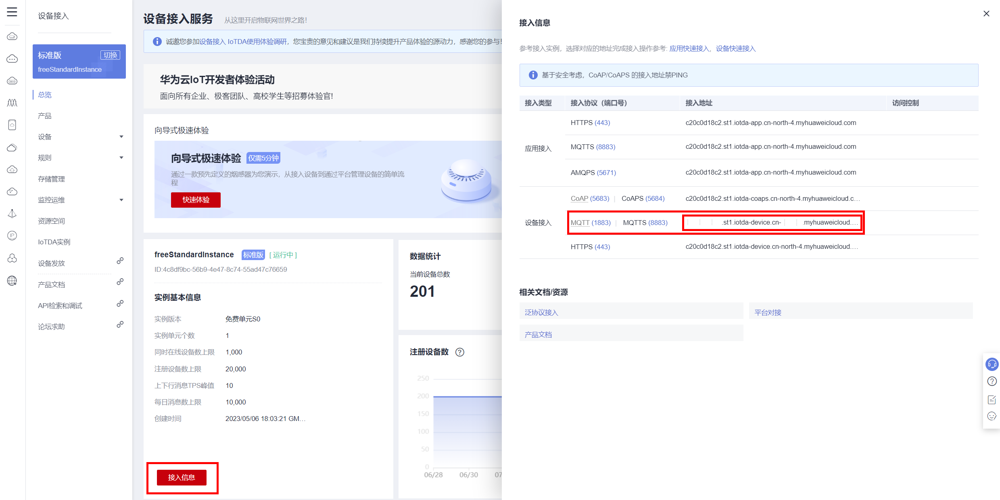
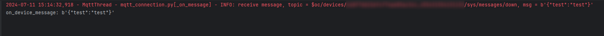
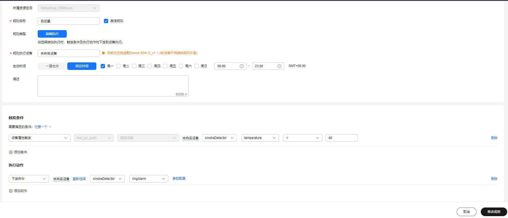
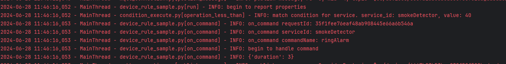
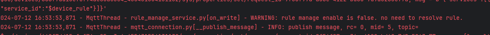
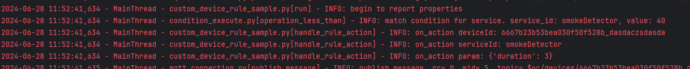
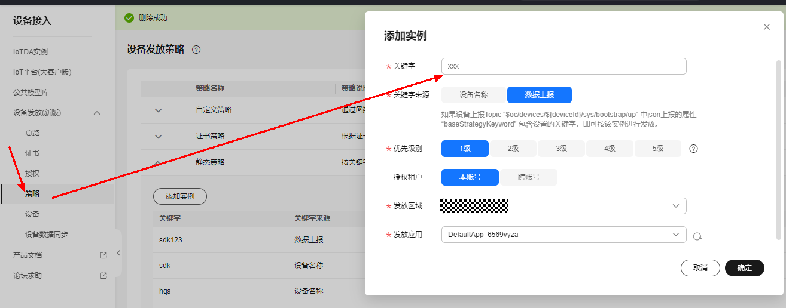
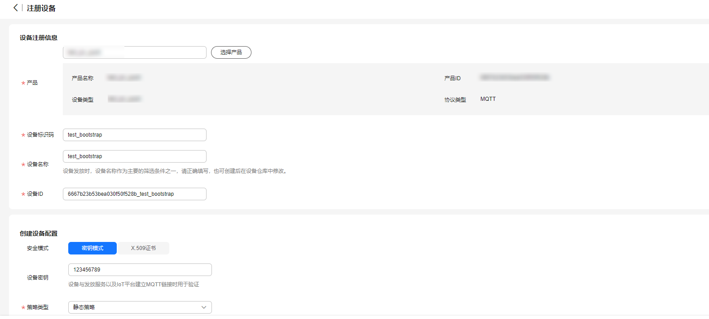
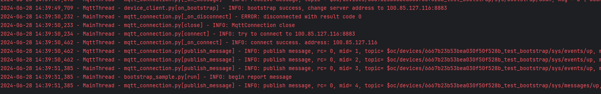

   [English](./README.md) | 简体中文

# iot-device-sdk-python开发指南

[TOC]
# 0.版本更新说明
| 版本    |变更类型| 说明                                               |
|:------|:-|:-------------------------------------------------|
| 1.2.0 |新增功能| 增加规则引擎、设备发放功能、自定义断线重连功能、升级组件版本                         |                                  
| 1.1.4 |新增功能| OTA升级支持网关模式                                      |
| 1.1.3 |功能增强| 更新服务端ca证书                                        |
| 1.1.2 |新增功能| 增加micropython支持和对应demo，从OBS下载OTA，以及说明文档          |
| 1.1.1 |新增功能| 提供对接华为云IoT物联网平台能力，方便用户实现安全接入、设备管理、数据采集、命令下发等业务场景 |

# 1.前言
iot-device-sdk-python（以下简称SDK）提供设备接入华为云IoT物联网平台的Python版本的SDK，提供设备和平台之间通讯能力，
以及设备服务、网关服务、OTA等高级服务，并且针对各种场景提供了丰富的demo代码。
IoT设备开发者使用SDK可以大大简化开发复杂度，快速的接入平台。

本文通过实例讲述SDK帮助设备用MQTT协议快速连接到华为物联网平台。

华为云官网：https://www.huaweicloud.com/

点击华为云官网右上角“控制台”进入管理控制台，在页面上方搜索“IoTDA”进入设备接入服务控制台。

# 2.SDK简介
## 2.1功能简介
SDK面向运算、存储能力较强的嵌入式终端设备，开发者通过调用SDK接口，便可实现设备与物联网平台的上下行通讯。SDK当前支持的功能有：
*  支持设备消息、属性上报、属性读写、命令下发
*  支持OTA升级
*  支持密码认证和证书认证两种设备认证方式
*  支持设备影子查询
*  支持网关服务、子设备管理、子设备消息转发
*  支持面向物模型编程
*  支持自定义topic
*  支持文件上传/下载
*  支持端侧规则
*  支持设备发放

## 2.2SDK目录结构
<table>
  <tr>
    <td>目录结构</td>
    <td>目录</td>
    <td>说明</td>
  </tr>
 <tr>
   <td rowspan=10>iot-device-sdk-python</td>
   <td> client</>
   <td> 设备客户端</td>
  </tr>
  <tr>
   <td>devicelog</td>
   <td>设备日志</td>
  </tr>
  <tr>
   <td>filemanager</td>
   <td>文件系统</td>
  </tr>
  <tr>
   <td>gateway</td>
   <td>网关</td>
  </tr>
  <tr>
   <td>ota</td>
   <td>软固件升级</td>
  </tr>
  <tr>
   <td>rule</td>
   <td>端侧规则</td>
  </tr>
  <tr>
   <td>service</td>
   <td>抽象服务</td>
  </tr>
  <tr>
   <td>timesync</td>
   <td>时间同步</td>
  </tr>
  <tr>
   <td>transport</td>
   <td>监听器</td>
  </tr>
  <tr>
   <td>util</td>
   <td>工具类</td>
  </tr>
  <tr>
  <td rowspan=8>iot-device-demo</td>
   <td> bootstrap </td>
   <td> 设备发放演示类</td>
   </tr>
   <tr>
   <td>command</td>
   <td>命令演示类</td>
  </tr>
<tr>
   <td>device</td>
   <td>设备演示，如设备重连、设备属性、设备信息、时间同步等</td>
  </tr>
  <tr>
   <td>filemanage</td>
   <td>文件上传下载演示类</td>
  </tr>
  <tr>
   <td>message</td>
   <td>设备消息演示类</td>
  </tr>
  <tr>
   <td>ota</td>
   <td>软固件升级演示类</td>
  </tr>
  <tr>
   <td>rule</td>
   <td>端侧规则演示类</td>
  </tr>
  <tr>
   <td>download、resource</td>
   <td>证书与测试文件存储</td>
  </tr>
  <tr>
  <td>iot-gateway-demo</td>
   <td> iot-gateway-demo </td>
   <td> 网关演示类</td>
   </tr>
   <tr>
   <td>requirement</td>
   <td> requirement</td>
   <td> sdk依赖</td>
   </tr>
</table>

# 3.准备工作

*  已安装Python 3.11.4

*  已安装第三方类库paho-mqtt：2.0.0  (必需)

*  已安装第三方类库schedule: 1.2.2   (必需)

*  已安装第三方类库apscheduler: 3.10.4   (必需)

*  已安装第三方类库requests: 2.32.2 （可选，在网关与子设备管理demo演示中使用）

*  已安装第三方类库tornado: 6.3.3     （可选，在网关与子设备管理demo演示中使用）

可以直接运行requirement/install_requirements.py进行依赖安装

# 4.SDK功能
## 4.1 上传产品模型并注册设备
为了方便体验，我们提供了一个烟感的产品模型，烟感会上报烟雾值、温度、湿度、烟雾报警、还支持响铃报警命令。
以烟感例，体验消息上报、属性上报、命令响应等功能。

* 访问[设备接入服务](https://www.huaweicloud.com/product/iothub.html) ，单击“立即使用”进入设备接入控制台。

* 点击“接入信息”,查看MQTT设备接入地址并保存该地址。

   


* 在设备接入控制台选择“产品”，单击右上角的”创建产品”，在弹出的页面中，填写“产品名称“、“协议类型”、“数据格式”、“厂商名称”、“所属行业”、“设备类型”等信息，然后点击右下角“立即创建”。

   - 协议类型选择“MQTT”；

   - 数据格式选择“JSON”。
 
   

* 产品创建成功后，单击“详情”进入产品详情，在功能定义页面，单击“上传模型文件”，上传烟感产品模型[smokeDetector](https://iot-developer.obs.cn-north-4.myhuaweicloud.com/smokeDetector.zip) 。
    生成的产品模型如下图所示。

    

* 在左侧导航栏，选择“设备 > 所有设备”，单击右上角“注册设备”，在弹出的页面中，填写注册设备参数，然后单击“确定”。

   

* 设备注册成功后保存设备标识码、设备ID、密钥。

## 4.2 在线调试工具
在控制台左侧导航栏，选择“监控运维 > 在线调试”可以进入在线调试页面。
页面中有命令下发、消息跟踪功能。

*  点击页面右上角的“选择设备”选择已注册的设备

*  点击“IoT平台”会显示消息跟踪

*  点击页面右下角的“发送”可以发送命令给设备

## 4.3 设备初始化
* 创建设备。

   设备接入平台时，物联网平台提供密钥和证书两种鉴权方式。

   * 如果您使用1883端口通过密钥鉴权接入平台，需要写入获取的设备ID、密钥。

   ```python
    server_uri = "access address" # 需要改为用户保存的接入地址
    port = 1883
    device_id = "your device id"
    secret = "your device secret"

    connect_auth_info = ConnectAuthInfo()
    connect_auth_info.server_uri = server_uri
    connect_auth_info.port = port
    connect_auth_info.id = device_id
    connect_auth_info.secret = secret
    client_conf = ClientConf(connect_auth_info)

    device = IotDevice(client_conf)
   ```

   * 如果您使用8883端口通过密钥鉴权接入平台（推荐使用，SDK的demo均通过此方法接入平台），需要写入获取的设备ID、密钥以及预置CA证书。
   预置的证书：/iot_device_demo/resources/root.pem
  
   ```python
    server_uri = "access address"   # 需要改为用户保存的接入地址
    port = 8883
    device_id = "your device id"
    secret = "your device secret"
    # iot平台的CA证书，用于服务端校验
    iot_ca_cert_path = "./resources/root.pem"
   
    connect_auth_info = ConnectAuthInfo()
    connect_auth_info.server_uri = server_uri
    connect_auth_info.port = port
    connect_auth_info.id = device_id
    connect_auth_info.secret = secret
    connect_auth_info.iot_cert_path = iot_ca_cert_path
    client_conf = ClientConf(connect_auth_info)

    device = IotDevice(client_conf)
   ```
   * 如果您使用8883端口并通过X509证书鉴权接入平台，则需要写入获取的设备ID，证书信息以及预制CA证书。更多X509证书接入请参考[X509证书接入](https://support.huaweicloud.com/bestpractice-iothub/iot_bp_0077.html)
     预置的证书：/iot_device_demo/resources/root.pem
   
    ```python
    server_uri = "access address"
    port = 8883
    device_id = "your device id"
    iot_ca_cert_path = "./resources/root.pem"
    cert_path = "your device cert"
    key_path = "your device cert key"

    connect_auth_info = ConnectAuthInfo()
    connect_auth_info.server_uri = server_uri
    connect_auth_info.port = port
    connect_auth_info.id = device_id
    connect_auth_info.auth_type = ConnectAuthInfo.X509_AUTH
    connect_auth_info.cert_path = cert_path
    connect_auth_info.key_path = key_path
    connect_auth_info.iot_cert_path = iot_ca_cert_path
    connect_auth_info.bs_mode = ConnectAuthInfo.BS_MODE_DIRECT_CONNECT

    client_conf = ClientConf(connect_auth_info)

    device = IotDevice(client_conf)
    ```

* 调用connect接口，建立连接。该接口是阻塞调用，如果建立连接成功会返回0。

   ```python
        if device.connect() != 0:
            return
   ```

* 连接成功后，设备和平台之间开始通讯。调用IotDevice的get_client方法获取设备客户端，客户端提供了消息、属性、命令等通讯接口。
例如：
   ```python
        device.get_client().set_command_listener(...)
        device.get_client().report_device_message(...)
   ```

*  关于IotDevice类的详细信息参见/iot_device_sdk_python/iot_device.py

若连接成功，在线调试页面的“消息跟踪”会显示：


运行日志为：


## 4.4 命令下发
/iot_device_demo/command/command_sample.py是一个处理平台命令下发的例子。
设置命令监听器用来接收平台下发的命令，在回调接口里，将对命令进行处理，并上报响应。

下面代码的CommandSampleListener类继承CommandListener类，实现了其中的on_command方法。
将CommandSampleListener的实例设置为命令监听器，即：

```python
device.get_client().set_command_listener(CommandSampleListener(device))
```

当device收到命令时将自动调用监听器中的on_command方法。
例子在on_command方法中打印命令的内容，并将响应返回给平台。

```python
class CommandSampleListener(CommandListener):
    def __init__(self, iot_device: IotDevice):
        """ 传入一个IotDevice实例 """
        self.device = iot_device

    def on_command(self, request_id, service_id, command_name, paras):
        logger.info('on_command requestId: ' + request_id)
        # 处理命令
        logger.info('begin to handle command')

        """ code here """
        logger.info(str(paras))

        # 命令响应
        command_rsp = CommandRsp()
        command_rsp.result_code = 0
        command_rsp.response_name = command_name
        command_rsp.paras = {"content": "Hello Huawei"}
        self.device.get_client().response_command(request_id, command_rsp)


def run():
    
    < create device code here ... >
    
    # 设置监听器
    device.get_client().set_command_listener(CommandSampleListener(device))
    
    if device.connect() != 0:
        logger.error('init failed')
        return

    while True:
        time.sleep(5)
```

执行run函数，在“在线调试”页面给设备下发命令，代码会产生以下输出：


同时，设备对命令的响应可以在“在线调试”的“消息跟踪”处找到。


## 4.5 平台消息下发/设备消息上报
消息下发是指平台向设备下发消息。消息上报是指设备向平台上报消息。更多设备消息信息请参考[设备消息文档](https://support.huaweicloud.com/usermanual-iothub/iot_01_0322.html)

### 4.5.1 消息上报
/iot_device_demo/message/message_sample.py是一个消息上报的例子。
```python
    """ create device code here """

    default_publish_listener = DefaultPublishActionListener()
    device_message = DeviceMessage()
    device_message.content = "Hello Huawei"

    device_message2 = DeviceMessage()
    device_message2.content = "Custom topic Message"

    device_message3 = DeviceMessage()
    device_message3.content = "Custom Policy topic Message"
    # 定时上报消息
    while True:
        # 通过平台默认topic上报消息
        device.get_client().report_device_message(device_message,
                                                  default_publish_listener)
        time.sleep(1)

        payload = json.dumps(device_message2.to_dict())
        # 通过平台自定义topic上报消息
        device.get_client().publish_raw_message(RawMessage(custom_topic, payload, 1), default_publish_listener)
        time.sleep(1)

        payload = json.dumps(device_message3.to_dict())
        # 通过平台自定义策略中的topic上报消息
        device.get_client().publish_raw_message(RawMessage(custom_policy_topic, payload, 1), default_publish_listener)
        time.sleep(5)
```
在上述代码中， 可以通过report_device_message方法将消息上报给平台的默认topic，也可以使用publish_raw_message方法将消息通过自定义topic上报给平台。若发送成功，在“在线调试”页面可以看到：


### 4.5.2 消息下发
/iot_device_demo/message/message_delivery_sample.py是一个消息下发的例子。
```python
class CustomConnectListener(ConnectListener):

    def __init__(self, iot_device: IotDevice):
        """ 传入一个IotDevice实例 """
        self.device = iot_device

    def connection_lost(self, cause: str):
        """
        连接丢失通知

        Args:
            cause:   连接丢失原因
        """
        logger.warning("connection lost. cause: " + cause)
        logger.warning("you can define reconnect in this method.")

    # 自定义topic订阅需放在链接建立成功后，防止断线重连后没有订阅topic
    def connect_complete(self, reconnect: bool, server_uri: str):
        """
        连接成功通知，如果是断链重连的情景，重连成功会重新订阅topic

        Args:
            reconnect:   是否为重连（当前此参数没有作用）
            server_uri:  服务端地址
        """
        # 自定义topic 以$oc/devices/{device_id}/user/开头，
        custom_topic = "$oc/devices/{device_id}/user/{topic}"
        # 自定义策略Topic 可以不以$oc开头， 例如：testdevicetopic
        custom_policy_topic = "{custom_topic}"
        # 使用自定义topic设置监听器接收平台下行消息
        self.device.get_client().subscribe_topic(custom_topic, 1, RawDeviceMsgListener())
        # 使用自定义策略topic设置监听器接收平台下行消息
        self.device.get_client().subscribe_topic(custom_policy_topic, 1, RawDeviceMsgListener())
        logger.info("connect success. server uri is " + server_uri)

class RawDeviceMsgListener(RawDeviceMessageListener):
    def on_raw_device_message(self, message: RawDeviceMessage):
        """
        处理平台下发的设备消息
        :param message:     设备消息内容
        """
        device_msg = message.to_device_message()
        if device_msg:
            print("on_device_message got system format:", message.payload)
        else:
            print("on_device_message:", message.payload)

        """ code here """
        pass


def run():
    < create device code here ... >

    # 设置监听器接收平台下行消息
    device.get_client().set_raw_device_msg_listener(RawDeviceMsgListener())
    device.get_client().add_connect_listener(CustomConnectListener(device))
    if device.connect() != 0:
        logger.error("init failed")
        return

```

上面代码中subscribe_topic可以订阅自定义topic下发的消息，若不使用自定义topic下发的消息，则使用平台默认topic下发消息。执行run函数后，您可以在平台使用消息下发，代码会产生以下输出：



## 4.6 属性上报/设置
属性上报指的是设备将当前属性值上报给平台。属性设置指的是平台设置设备的属性值。
/iot_device_demo/device/properties_sample.py是一个属性上报/设置的例子。
### 4.6.1 属性上报
用于设备按产品模型中定义的格式将属性数据上报给平台。平台会将上报的数据赋给设备影子数据。


   ```python
   def run():
       < create device code here ... >
   
       if device.connect() != 0:
           logger.error('init failed')
           return
   
       service_property = ServiceProperty()
       service_property.service_id = 'smokeDetector'
       service_property.properties = {'alarm': 10, 'smokeConcentration': 36, 'temperature': 64, 'humidity': 32}
       services = [service_property.to_dict()]
   
       while True:
           device.get_client().report_properties(services, DefaultPublishActionListener())
           time.sleep(5)
   ```

上面代码将周期性地上报alarm、smokeConcentration、temperature、humidity这四个属性。
若上报成功，“在线调试”页面会显示：


在左侧导航栏中选择“设备 > 所有设备”，选择注册的设备进行查看，在“设备影子”处可以看到刚刚上报的属性值。


### 4.6.2 平台设置设备属性
若将PropertySampleListener的实例设置为属性监听器，即：

```python
device.get_client().set_properties_listener(PropertySampleListener(device))
```

那么当device收到属性读写请求时将自动调用监听器中的on_property_set或on_property_get方法。
其中on_property_set方法处理写属性，on_property_get方法处理读属性。
多数场景下，用户可以直接从平台读设备影子，因此on_property_get方法不用实现。
但如果需要支持从设备实时读属性，则需要实现此方法。
例子在on_property_set方法中打印属性设置的内容，并将响应返回给平台。

```python
class PropertySampleListener(PropertyListener):
    def __init__(self, iot_device: IotDevice):
        """ 传入一个IotDevice实例 """
        self.device = iot_device

    def on_property_set(self, request_id, services: [ServiceProperty]):
        """ 遍历service """
        for service_property in services:
            logger.info("on_property_set, service_id:" + service_property.service_id)
            """ 遍历属性 """
            for property_name in service_property.properties:
                logger.info('set property name:' + property_name)
                logger.info("set property value:" + str(service_property.properties[property_name]))
        self.device.get_client().respond_properties_set(request_id, iot_result.SUCCESS.to_dict())

    def on_property_get(self, request_id, service_id):
        pass


def run():
    < create device code here ... >
    
    device.get_client().set_properties_listener(PropertySampleListener(device))

    if device.connect() != 0:
        return
```

在“设备影子”处，点击“属性配置”可以设置属性的期望值。
若设置的期望值与设备的上报值不一样，在设备上线时，平台会自动把期望值发送给设备。（即平台设置设备属性）


运行上面的run函数，得到：


## 4.7 设备影子
用于设备向平台获取设备影子数据。设备可以获取到平台设备影子数据，以此来同步设备属性值，从而完成设备属性值的修改。

/iot_device_demo/device/device_shadow_sample.py是设备获取平台设备影子数据的一个例子。

* 设备请求获取平台的设备影子数据。

   ```python
    # 接收平台下行响应
    device.get_client().set_device_shadow_listener(DeviceShadowSampleListener())

    if device.connect() != 0:
        logger.error('init failed')
        return

    # 设备侧获取平台的设备影子数据
    request_id = str(uuid.uuid1())
    device.get_client().get_device_shadow(request_id, {'service_id': 'smokeDetector'}, None)
   ```

* 设备接收平台返回的设备影子数据。

   ```python
   class DeviceShadowSampleListener(DeviceShadowListener):
    """
    实现影子数据下发监听器的一个例子
    """
    def on_shadow_get(self, request_id: str, object_device_id: str, shadow: List[ShadowData]):
        """
        处理平台下发的设备影子数据
        :param request_id:  请求id
        :param object_device_id:    设备id
        :param shadow:     dict
        """
        logger.info("on_shadow_get request_id: " + request_id)
        logger.info("on_shadow_get device_id: " + object_device_id)
        print("shadow service_id: " + shadow[0].service_id)
        print("shadow desired properties: " + str(shadow[0].desired.properties))
        print("shadow reported properties: " + str(shadow[0].reported.properties))
   ```

## 4.8 面向物模型编程
面向物模型编程指的是，基于SDK提供的物模型抽象能力，设备代码只需要按照物模型定义设备服务，SDK就能自动的和平台通讯，
完成属性的同步和命令的调用。相比直接调用客户端接口和平台通讯，面向物模型编程简化了设备侧代码的复杂度，
让设备代码只需要关注业务，而不用关注和平台的通讯过程。

**/iot_device_demo/device/smoke_detector.py**是一个面向物模型编程的例子。

首先定义一个烟感服务类，继承自AbstractService类

```python
class SmokeDetectorService(AbstractService)
```

定义服务属性，属性和产品模型保持一致。
*  注意：属性的prop_name需要和模型一致，writeable表示属性是否可写；

field_name为变量的名字，val为属性的值。

```python
smoke_alarm = Property(val=20, field_name="smoke_alarm", prop_name="alarm", writeable=True)
concentration = Property(val=float(32.0), field_name="concentration", prop_name="smokeConcentration", writeable=False)
humidity = Property(val=64, field_name="humidity", prop_name="humidity", writeable=False)
temperature = Property(val=float(36.0), field_name="temperature", prop_name="temperature", writeable=False)
```

定义属性的读写方法：
*  get_xxx方法为读方法，在属性上报和平台主动查询属性时被SDK调用；
*  set_xxx方法为写方法，在平台修改属性时被SDK调用，如果属性是只读的，则set_xxx方法保留空实现；

```python
    # get和set接口的命名规则：get_ + 属性的变量名；设置正确，SDK会自动调用这些接口
    def get_humidity(self):
        # 模拟从传感器读取数据
        self.humidity.val = 32
        return self.humidity.val

    def set_humidity(self, humidity):
        # humidity是只读的，不需要实现
        pass

    def get_temperature(self):
        # 模拟从传感器读取数据
        self.temperature.val = 64
        return self.temperature.val

    def set_temperature(self, temperature):
        # 只读字段不需要实现set接口
        pass

    def get_concentration(self):
        # 模拟从传感器读取数据
        self.concentration.val = 36
        return self.concentration.val

    def set_concentration(self, concentration):
        # 只读字段不需要实现set接口
        pass

    def get_smoke_alarm(self):
        return self.smoke_alarm.val

    def set_smoke_alarm(self, smoke_alarm: int):
        self.smoke_alarm.val = smoke_alarm
        if smoke_alarm == 10:
            self._logger.info("set alarm:" + str(smoke_alarm))
            self._logger.info("alarm is clear by app")
```

定义服务的命令：
命令的输入参数和返回值类型是固定的不能修改，否则会出现运行时的错误。

```python
    def alarm(self, paras: dict):
        duration = paras.get("duration")
        self._logger.info("ringAlarm duration = " + str(duration))
        command_rsp = CommandRsp()
        command_rsp.result_code = command_rsp.SUCCESS()
        return command_rsp
```

上面完成了服务的定义（更详细的代码见/iot_device_demo/device/smoke_detector.py中的SmokeDetectorService类）。
接下来创建设备，注册烟感服务，然后初始化设备。设备连接成功，烟感服务将启动周期上报属性功能。

```python
class SmokeDetector:
    def __init__(self, server_uri, port, device_id, secret):
        self.server_uri = server_uri
        self.port = port
        self.device_id = device_id
        self.secret = secret

    def start(self):
        """ 创建设备 """
        < create device code here ... >
        
        """ 添加烟感服务 """
        smoke_detector_service = SmokeDetectorService()
        device.add_service("smokeDetector", smoke_detector_service)
        """ 设备连接平台 """
        if device.connect() != 0:
            return
        
        """ 启动自动周期上报 """
        smoke_detector_service.enable_auto_report(5)

        """ 20s后结束周期上报 """
        time.sleep(20)
        smoke_detector_service.disable_auto_report()
```

若属性上报成功，“在线调试”页面会显示：


在“在线调试”页面给设备发送命令，物模型会自动调用SmokeDetectorService类的alarm方法，输出以下结果：


## 4.9 OTA升级
在/iot_device_demo/ota/ota_sample.py中实现了一个OTA升级的例子，如下面代码所示。

```python
def run():
   < create device code here ... >

    """ OTA监听器设置 """
    ota_service: OTAService = device.get_ota_service()
    ota_service_listener = OTASampleListener(ota_service)
    ota_service.set_ota_listener(ota_service_listener)

    if device.connect() != 0:
        return
```

OTAService服务是系统本身定义的服务，可以通过device的get_ota_service方法获取。
用户需要实现的是OTA监听器，/iot_device_demo/ota/ota_sample.py中的OTASampleListener类是一个监听器实现的例子。
OTASampleListener类继承OTAListener类，必须要实现两个方法：
*  on_query_version  接收查询版本通知。需要实现此方法来将当前的版本号返回给平台。
*  on_receive_package_info    接收新版本通知。需要实现此方法来下载包并安装升级。

### 4.9.1 如何进行OTA升级

1. 固件升级。参考[固件升级](https://support.huaweicloud.com/usermanual-iothub/iot_01_0027.html)

2. 软件升级。参考[软件升级](https://support.huaweicloud.com/usermanual-iothub/iot_01_0047.html)

## 4.10 文件上传/下载
在/iot_device_demo/filemanage/file_sample.py中实现了一个文件上传/下载的例子。

```python
def run():
    < create device code here ... >

    """ 设置文件管理监听器 """
    file_manager: FileManagerService = device.get_file_manager_service()
    file_manager_listener = FileManagerSampleListener()
    file_manager.set_listener(file_manager_listener)

    if device.connect() != 0:
        logger.error('init failed')
        return

    """ 文件上传 """
    upload_file_path = os.path.dirname(__file__) + r'/download/upload_test.txt'
    file_name = "upload_test.txt"
    file_manager.get_upload_url(upload_file_path=upload_file_path, file_name=file_name)

    # 10s后将刚刚上传的upload_test.txt下载下来，保存到download.txt
    time.sleep(10)

    """ 文件下载 """
    download_file_path = os.path.dirname(__file__) + r'/download/download.txt'
    file_manager.get_download_url(download_file_path=download_file_path, file_name=file_name)
```

FileManagerService服务是系统本身定义的服务，可以通过device的get_file_manager_service方法获取。
用户需要实现的是FileManagerService监听器，
/iot_device_demo/filemanage/file_sample.py中的FileManagerSampleListener类是一个监听器实现的例子。
FileManagerSampleListener类继承FileManagerListener类，必须要实现两个方法：
*  on_upload_url     接收平台下发的文件上传url。
*  on_download_url   接收平台下发的文件下载url。

文件上传/下载流程参考[文件上传](https://support.huaweicloud.com/usermanual-iothub/iot_01_0033.html)

* 在控制台中配置OBS存储。
   
   

* 预置好上传文件。上面例子的待上传文件为/iot_device_demo/filemanage/download/upload_test.txt。
   文件下载部分将已上传的upload_test.txt下载下来保存到/iot_device_demo/filemanage/download/download.txt。

* 执行上面例子可到OBS上看到存储结果。
   
   


## 4.11 设备时间同步
在/iot_device_demo/device/ntp_sample.py中实现了一个设备时间同步的例子。

```python
def run():
   < create device code here ... >

    """ 设置时间同步服务 """
    time_sync_service: TimeSyncService = device.get_time_sync_service()
    time_sync_listener = TimeSyncSampleListener()
    time_sync_service.set_listener(time_sync_listener)

    if device.connect() != 0:
        logger.error('init failed')
        return

    # 请求时间同步
    time_sync_service.request_time_sync()
```

TimeSyncService服务是系统本身定义的服务，可以通过device的get_time_sync_service方法获取。
用户需要实现的是TimeSyncListener监听器，
/iot_device_demo/device/ntp_sample.py中的TimeSyncSampleListener类是一个监听器实现的例子。
TimeSyncSampleListener类继承TimeSyncListener类，必须要实现一个方法：
*  on_time_sync_response   时间同步响应。假设设备收到的设备侧时间为device_recv_time，则设备计算自己的准确时间为：
        (server_recv_time + server_send_time + device_recv_time - device_send_time) / 2

## 4.12 网关与子设备管理
此功能参考[网关与子设备](https://support.huaweicloud.com/usermanual-iothub/iot_01_0052.html)

网关与子设备管理的demo代码在/iot_gateway_demo下。此demo演示如何使用网关来实现TCP协议设备接入。
网关和平台只建立一个MQTT连接，使用网关的身份和平台进行通讯。

此demo有两个可运行的.py文件，
分别是/iot_gateway_demo/string_tcp_server.py和/iot_gateway_demo/tcp_device.py，
分别是网关和tcp设备的代码。

此demo可以演示：
1. 网关同步子设备列表。网关设备不在线时，平台无法将子设备新增和删除的信息及时通知到网关设备。
2. 网关设备离线再上线时，平台会通知新增/删除的子设备信息。
3. 网关更新子设备状态。网关通知平台子设备的状态为“ONLINE“。
4. 子设备通过网关上报消息到平台。
5. 平台给子设备下发命令。
6. 网关新增/删除子设备请求

### 4.12.1 如何运行
先运行string_tcp_server.py（需要填写网关的设备Id、设备密钥和产品Id），网关会与平台建立连接，并同步子设备的列表。

然后运行tcp_device.py（需要填写子设备Id），在运行界面输入任意字符串，例如“go online“。
这是子设备发给网关的第一条消息，如果此子设备已在平台上进行注册，网关会通知平台将子设备的状态设为“ONLINE；
如果此子设备并没有在平台上进行注册，网关会将此子设备注册到平台，下面是这种情形的演示。

首先运行string_tcp_server.py，在tcp_device.py中填写子设备Id后（此设备Id没有在平台上注册），运行tcp_device.py，在运行界面输入一个字符串，例如：


此时网关会向平台发起新增子设备的请求，在平台上可以看到新创建的子设备：


确认子设备已经创建成功后，在运行界面输入一个字符串，网关将通知平台更新子设备状态为ONLINE，例如：


确认子设备在平台上的状态为在线后，在运行界面输入一个字符串，网关将上报给平台，例如：


如果在运行界面输入gtwdel，网关将向平台发送删除此子设备的请求：


可以从平台看到此子设备被删除了。

## 4.13 上报设备信息
在/iot_device_demo/device/report_device_info_sample.py中实现了一个设备信息上报的例子。
设备信息包括固件版本、软件版本以及SDK版本。
需要注意的是，若connect_auth_info.auto_report_device_info = True，则在设备与平台首次建链的时候，SDK会自动上报一次只包含SDK版本号的设备信息。

```python
def run():
    """< create device code here ... >"""

    if device.connect() != 0:
        logger.error('init failed')
        return

    """ 上报设备信息 """
    device_info = DeviceBaseInfo()
    device_info.fw_version = "v1.0"
    device_info.sw_version = "v1.0"
    device.get_client().report_device_info(device_info)3
```
## 4.14 设备日志上报说明
在下面两种情况下，SDK会自动上报设备的日志。其余情况、功能的日志需要用户自行上报。

1. 设备与平台首次建链成功时，SDK会自动上报一条设备日志，例如：

    ```json
    {
        "object_device_id": "6109fd1da42d680286bb1ff3_123456",
        "services": [{
         "service_id": "$log", 
         "event_type": "log_report", 
         "event_time": "2021-09-11T10:36:18Z", 
         "event_id": "", 
         "paras": {
             "timestamp": "1631327778381", 
             "type": "DEVICE_STATUS", 
             "content": "connect complete, the uri is iot-mqtts.cn-north-5.myhuaweicloud.com"
         }
        }]
    }
    ```

2. 设备与平台断链重连后，SDK会自动上报两条设备日志，
   一条记录了设备断链重连成功的时间戳，一条记录了设备断链的时间戳。格式与上面的一致。


## 4.15 端侧规则
在控制台创建一个端侧规则:


在/iot_device_demo/rule/device_rule_sample.py中实现了一个端侧规则的例子。您可以通过以下参数开启端侧规则
```python
connect_auth_info.enable_rule_manage = True
```
通过CommandSampleListener实现CommandListener类，并重写其中的on_command方法。将CommandSampleListener的实例设置为命令监听器，即：

```python
device.get_client().set_command_listener(CommandSampleListener(device))
```

当规则触发时，device收到命令将自动调用监听器中的on_command方法。
例子在on_command方法中打印命令的内容，客户可以自定义该内容来实现设备的一系列操作。

```python
class CommandSampleListener(CommandListener):
    def __init__(self, iot_device: IotDevice):
        """ 传入一个IotDevice实例 """
        self.device = iot_device

    def on_command(self, request_id, service_id, command_name, paras):
        logger.info('on_command requestId: ' + request_id)
        # 处理命令
        logger.info('begin to handle command')

        """ code here """
        logger.info(str(paras))

        # 命令响应
        command_rsp = CommandRsp()
        command_rsp.result_code = 0
        command_rsp.response_name = command_name
        command_rsp.paras = {"content": "Hello Huawei"}
        self.device.get_client().response_command(request_id, command_rsp)


def run():
    
    < create device code here ... >
    
    # 设置监听器
    device.get_client().set_command_listener(CommandSampleListener(device))
    
    if device.connect() != 0:
        logger.error('init failed')
        return

    logger.info("begin to report properties")
    # 按照产品模型设置属性
    service_property = ServiceProperty()
    service_property.service_id = "smokeDetetor"
    service_property.properties = {"temperature": 10}
    # 组装成列表的形式
    services = [service_property]

    # 上报设备属性
    device.get_client().report_properties(services)
    while True:
        time.sleep(5)
```

执行run函数，代码会产生以下输出：

若设备侧没有开启端侧规则开关，则代码会产生以下输出：


若想使用自定义方式对端侧规则的action进行处理，在/iot_device_demo/rule/custom_device_rule_sample.py中实现了一个自定义端侧规则的例子。
下面代码的ActionHandlerListener类继承ActionHandler类，实现了其中的handle_rule_action方法。
将ActionHandlerListener的实例设置为命令监听器，即：

```
device.get_client().set_rule_action_handler(ActionHandlerListener())
```

当规则触发时，device收到命令将自动调用监听器中的on_command方法。
例子在handle_rule_action方法中实现一些自定义操作。例如以下输出：



## 4.16 设备发放
在控制台创建一个发放策略，关键字为xxx:


在控制台创建一个设备，策略类型选择静态策略，产品选择与创建的策略在同一区域内的：


在/iot_device_demo/bootstrap/bootstrap_sample.py中实现了一个使用静态策略发放设备的例子。将server_uri修改为发放的地址，设备和密码选择刚刚创建的设备id和密码，
connect_auth_info.bs_message中baseStrategyKeyword的值xxx为创建的静态策略的关键字,填写正确的证书信息后。

```python
def run():
    server_uri = "iot-bs.cn-north-4.myhuaweicloud.com"
    port = 8883
    device_id = "your device id"
    secret = "your device secret"
    iot_cert_file_path = "iot cert path"
    bs_cert_path = "./resources/root.pem"

    connect_auth_info = ConnectAuthInfo()
    connect_auth_info.server_uri = server_uri
    connect_auth_info.port = port
    connect_auth_info.id = device_id
    connect_auth_info.secret = secret
    connect_auth_info.check_timestamp = "0"
    connect_auth_info.iot_cert_path = iot_cert_file_path
    connect_auth_info.bs_cert_path = bs_cert_path
    connect_auth_info.bs_message = "{\"baseStrategyKeyword\":\"xxx\"}"

    client_conf = ClientConf(connect_auth_info)

    device = IotDevice(client_conf)
    if device.connect() != 0:
        logger.error("init failed")
        return

    logger.info("begin report message")
    device_message = DeviceMessage()
    device_message.content = "Hello Huawei"
    # 定时上报消息
    while True:
        device.get_client().report_device_message(device_message)
        time.sleep(10)
```
执行run函数，代码会产生以下输出：

设备发放成功后，会在/iot_device_demo中生成一个server_info.json文件， 文件中存储了发放成功后iotda的地址以及发放设备的密钥信息（仅注册组密钥发放时生成），待使用其他设备进行发放时，需要删除该文件。

除了/iot_device_demo/bootstrap/bootstrap_sample.py，在/iot_device_demo中还有bootstrap_cert_sample.py使用静态策略证书进行发放，bootstrap_groups_sample.py
使用静态策略进行注册组设备发放，bootstrap_groups_cert_sample.py使用证书策略进行注册组设备发放。详细参数可以参考以下链接：
[设备接入发放示例](https://support.huaweicloud.com/qs-iotps/iot_03_0006.html)

## 4.17 断链重连
在iot_device_demo/device/device_reconnec_sample.py中， 我们展示了断线重连的功能。
```python
class CustomConnectListener(ConnectListener):

    def __init__(self, iot_device: IotDevice):
        """ 传入一个IotDevice实例 """
        self.device = iot_device

    def connection_lost(self, cause: str):
        """
        连接丢失通知

        Args:
            cause:   连接丢失原因
        """
        logger.warning("connection lost. cause: " + cause)
        logger.warning("you can define reconnect in this method.")

    def connect_complete(self, reconnect: bool, server_uri: str):
        """
        连接成功通知

        Args:
            reconnect:   是否为重连（当前此参数没有作用）
            server_uri:  服务端地址
        """
        logger.info("connect success. server uri is " + server_uri)


def run():
    server_uri = "<<iotda server uri>>"
    port = 1883
    device_id = "<<device id>>"
    secret = "<<password>>"

    connect_auth_info = ConnectAuthInfo()
    connect_auth_info.server_uri = server_uri
    connect_auth_info.port = port
    connect_auth_info.id = device_id
    connect_auth_info.secret = secret
    connect_auth_info.check_timestamp = "0"
    connect_auth_info.bs_mode = ConnectAuthInfo.BS_MODE_DIRECT_CONNECT
    # 是否开启断线重连
    connect_auth_info.reconnect_on_failure = True
    # 断线重连最小退避时间
    connect_auth_info.min_backoff = 1 * 1000
    # 断线重连最大退避时间
    connect_auth_info.max_backoff = 30 * 1000
    # 断线后最大缓存消息条数
    connect_auth_info.max_buffer_message = 100

    client_conf = ClientConf(connect_auth_info)

    device = IotDevice(client_conf)
    if device.connect() != 0:
        logger.error("init failed")
        return

    device.get_client().add_connect_listener(CustomConnectListener(device))
    logger.info("begin report message")
    device_message = DeviceMessage()
    device_message.content = "Hello Huawei"
    # 定时上报消息
    while True:
        device.get_client().report_device_message(device_message, DefaultPublishActionListener())
        time.sleep(10)
```
您可以通过设置connect_auth_info.reconnect_on_failure=True来开启断线重连，设置为True之后，可以通过设置以下参数,来配置断线重连的时间间隔，以及最大退避时间。断线重连的具体逻辑，可以在iot_device_sdk_python.transport.mqtt.mqtt_connection.MqttConnection.connect()函数中查看。
```python
connect_auth_info.min_backoff = 1 * 1000
connect_auth_info.max_backoff = 30 * 1000
```
您也可以将其设置为False来关闭断线重连。然后通过自定义的方式来实现您自己的断线重连逻辑。sdk为您提供ConnectListener接口，您可以实现该接口中的connection_lost和connect_complete函数，sdk将会在建链成功以及连接断开时通知您，您可以在在函数中实现自己的断链重连逻辑，并通过以下方法，将该接口预制到sdk中：
```python
device.get_client().add_connect_listener(CustomConnectListener(device))
```
sdk还提供了max_buffer_message参数，若您设置了该参数，当sdk与平台断链后，您上报的消息都会缓存在内存中，最大缓存的数量则为max_buffer_message的值，若缓存消息超过该值后，会把最早进入缓存的数据给剔除掉。当再次与平台建链后，sdk将会把缓存中的消息重新发布到平台。
```python
connect_auth_info.max_buffer_message = 100
```

# 5.0开源协议
- 遵循BSD-3开源许可协议

# 6.0接口文档
参考[设备接入接口文档](./IoT-Device-SDK-Python-API文档.pdf)

# 7.0更多文档
参考[设备接入更多文档](https://support.huaweicloud.com/devg-iothub/iot_02_0178.html)