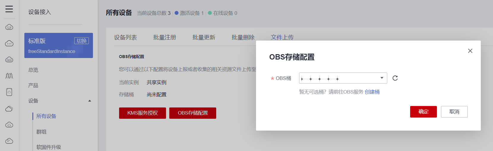

   [English](./README.md) | 简体中文

# iot-device-sdk-python开发指南
# 目录

- [SDK版本](#0)

- [前言](#1)

- [SDK简介](#2)
 
- [准备工作](#3)

- [上传产品模型并注册设备](#4)

- [在线调试工具](#5)

- [设备初始化](#6)

- [命令下发](#7)

- [平台消息下发/设备消息上报](#8)

- [属性上报/设置](#9)

- [设备影子](#10)

- [面向物模型编程](#11)

- [OTA升级](#12)

- [文件上传/下载](#13)

- [设备时间同步](#14)

- [网关与子设备管理](#15)

- [上报设备信息](#16)

- [设备日志上报说明](#17)

- [开源协议](#18)

- [接口文档](./IoT-Device-SDK-Python-API文档.pdf)

- [更多文档](https://support.huaweicloud.com/devg-iothub/iot_02_0178.html)

<h1 id="0">SDK版本</h1>

|版本|变更类型|说明|
|:-|:-|:-|
|1.1.2|新增功能|增加micropython支持和对应demo，从OBS下载OTA，以及说明文档|
|1.1.1|新增功能|提供对接华为云IoT物联网平台能力，方便用户实现安全接入、设备管理、数据采集、命令下发等业务场景|

<h1 id="1">前言</h1>

iot-device-sdk-python（以下简称SDK）提供设备接入华为云IoT物联网平台的Python版本的SDK，提供设备和平台之间通讯能力，
以及设备服务、网关服务、OTA等高级服务，并且针对各种场景提供了丰富的demo代码。
IoT设备开发者使用SDK可以大大简化开发复杂度，快速的接入平台。

本文通过实例讲述SDK帮助设备用MQTT协议快速连接到华为物联网平台。

华为云官网：https://www.huaweicloud.com/

点击华为云官网右上角“控制台”进入管理控制台，在页面上方搜索“IoTDA”进入设备接入服务控制台。

<h1 id="2">SDK简介</h1>

SDK面向运算、存储能力较强的嵌入式终端设备，开发者通过调用SDK接口，便可实现设备与物联网平台的上下行通讯。SDK当前支持的功能有：
*  支持设备消息、属性上报、属性读写、命令下发
*  支持OTA升级
*  支持密码认证和证书认证两种设备认证方式
*  支持设备影子查询
*  支持网关服务、子设备管理、子设备消息转发
*  支持面向物模型编程
*  支持自定义topic
*  支持文件上传/下载

**SDK目录结构**

iot_device_sdk_python：sdk代码

iot_device_demo：demo演示代码

iot_gateway_demo：网关与子设备管理demo演示代码

<h1 id="3">准备工作</h1>

*  已安装Python 3.8.2

*  已安装第三方类库paho-mqtt：1.5.0  (必需)

*  已安装第三方类库schedule: 1.1.0   (必需)

*  已安装第三方类库requests: 2.25.1  （可选，在网关与子设备管理demo演示中使用）

*  已安装第三方类库tornado: 6.1     （可选，在网关与子设备管理demo演示中使用）


<h1 id="4">上传产品模型并注册设备</h1>

为了方便体验，我们提供了一个烟感的产品模型，烟感会上报烟雾值、温度、湿度、烟雾报警、还支持响铃报警命令。
以烟感例，体验消息上报、属性上报、命令响应等功能。

* 访问[设备接入服务](https://www.huaweicloud.com/product/iothub.html) ，单击“立即使用”进入设备接入控制台。

* 查看平台接入地址。

   

* 查看MQTT设备接入地址，保存该地址。

   

* 在设备接入控制台选择“产品”，单击右上角的”创建产品”，在弹出的页面中，填写“产品名称“、“协议类型”、“数据格式”、“厂商名称”、“所属行业”、“设备类型”等信息，然后点击右下角“立即创建”。

   - 协议类型选择“MQTT”；

   - 数据格式选择“JSON”。
 
   

* 产品创建成功后，单击“详情”进入产品详情，在功能定义页面，单击“上传模型文件”，上传烟感产品模型[smokeDetector](https://iot-developer.obs.cn-north-4.myhuaweicloud.com/smokeDetector.zip) 。
    生成的产品模型如下图所示。

    

* 在左侧导航栏，选择“设备 > 所有设备”，单击右上角“注册设备”，在弹出的页面中，填写注册设备参数，然后单击“确定”。

   

* 设备注册成功后保存设备标识码、设备ID、密钥。

<h1 id="5">在线调试工具</h1>

在控制台左侧导航栏，选择“监控运维 > 在线调试”可以进入在线调试页面。
页面中有命令下发、消息跟踪功能。

*  点击页面右上角的“选择设备”选择已注册的设备

*  点击“IoT平台”会显示消息跟踪

*  点击页面右下角的“发送”可以发送命令给设备


<h1 id="6">设备初始化</h1>

* 创建设备。

   设备接入平台时，物联网平台提供密钥和证书两种鉴权方式。

   * 如果您使用1883端口通过密钥鉴权接入平台，需要写入获取的设备ID、密钥。

   ```
       server_uri = "iot-mqtts.cn-north-4.myhuaweicloud.com"   # 需要改为用户保存的接入地址
       port = 1883
       device_id = "< Your DeviceId >"
       sc = "< Your Device Secret >"
   
       device = IotDevice()
       device.create_by_secret(server_uri=server_uri,
                               port=port,
                               device_id=device_id,
                               secret=sc)
   ```

   * 如果您使用8883端口通过密钥鉴权接入平台（推荐使用，SDK的demo均通过此方法接入平台），需要写入获取的设备ID、密钥以及预置CA证书。
   预置的证书：/iot_device_demo/resources/GlobalSignRSAOVSSLCA2018.crt.pem
  
   ```
       server_uri = "iot-mqtts.cn-north-4.myhuaweicloud.com"   # 需要改为用户保存的接入地址
       port = 8883
       device_id = "< Your DeviceId >"
       sc = "< Your Device Secret >"
       # iot平台的CA证书，用于服务端校验
       iot_ca_cert_path = "./resources/GlobalSignRSAOVSSLCA2018.crt.pem"
   
       device = IotDevice()
       device.create_by_secret(server_uri=server_uri,
                               port=port,
                               device_id=device_id,
                               secret=sc,
                               iot_cert_file=iot_ca_cert_path)
   ```

* 调用init接口，建立连接。该接口是阻塞调用，如果建立连接成功会返回0。

   ```
        if device.connect() != 0:
            return
   ```

* 连接成功后，设备和平台之间开始通讯。调用IotDevice的get_client方法获取设备客户端，客户端提供了消息、属性、命令等通讯接口。
例如：
   ```
        device.get_client().set_command_listener(...)
        device.get_client().report_device_message(...)
   ```

*  关于IotDevice类的详细信息参见/iot_device_sdk_python/iot_device.py

若连接成功，在线调试页面的“消息跟踪”会显示：


运行日志为：


<h1 id="7">命令下发</h1>

/iot_device_demo/command_sample.py是一个处理平台命令下发的例子。
设置命令监听器用来接收平台下发的命令，在回调接口里，将对命令进行处理，并上报响应。

下面代码的CommandSampleListener类继承CommandListener类，实现了其中的on_command方法。
将CommandSampleListener的实例设置为命令监听器，即：

```
device.get_client().set_command_listener(CommandSampleListener(device))
```

当device收到命令时将自动调用监听器中的on_command方法。
例子在on_command方法中打印命令的内容，并将响应返回给平台。

```
class CommandSampleListener(CommandListener):
    def __init__(self, iot_device: IotDevice):
        """ 传入一个IotDevice实例 """
        self.device = iot_device

    def on_command(self, request_id, service_id, command_name, paras):
        logger.info('on_command requestId: ' + request_id)
        # 处理命令
        logger.info('begin to handle command')

        """ code here """
        logger.info(str(paras))

        # 命令响应
        command_rsp = CommandRsp()
        command_rsp.result_code = 0
        command_rsp.response_name = command_name
        command_rsp.paras = {"content": "Hello Huawei"}
        self.device.get_client().response_command(request_id, command_rsp)


def run():
    
    < create device code here ... >
    
    # 设置监听器
    device.get_client().set_command_listener(CommandSampleListener(device))
    
    if device.connect() != 0:
        logger.error('init failed')
        return

    while True:
        time.sleep(5)
```

执行run函数，在“在线调试”页面给设备下发命令，代码会产生以下输出：


同时，设备对命令的响应可以在“在线调试”的“消息跟踪”处找到。


<h1 id="8">平台消息下发/设备消息上报</h1>

消息下发是指平台向设备下发消息。消息上报是指设备向平台上报消息。
/iot_device_demo/message_sample.py是一个消息下发/上报的例子。

```
class RawDeviceMsgListener(RawDeviceMessageListener):
    def on_raw_device_message(self, message: RawDeviceMessage):
        """
        处理平台下发的设备消息
        :param message:     设备消息内容
        """
        device_msg = message.to_device_message()
        if device_msg:
            print("on_device_message got system format:", message.payload)
        else:
            print("on_device_message:", message.payload)

        """ code here """
        pass


def run():
    < create device code here ... >

    # 设置监听器接收平台下行消息
    device.get_client().set_raw_device_msg_listener(RawDeviceMsgListener())

    if device.connect() != 0:
        logger.error("init failed")
        return

    logger.info("begin report message")
    default_publish_listener = DefaultPublishActionListener()
    device_message = DeviceMessage()
    device_message.content = "Hello Huawei"
    # 定时上报消息
    while True:
        device.get_client().report_device_message(device_message,
                                                  default_publish_listener)
        time.sleep(5)
```

上面代码中的report_device_message方法将消息上报给平台，若发送成功，在“在线调试”页面可以看到：


<h1 id="9">属性上报/设置</h1>

属性上报指的是设备将当前属性值上报给平台。属性设置指的是平台设置设备的属性值。
/iot_device_demo/properties_sample.py是一个属性上报/设置的例子。

<h3>属性上报</h3>
用于设备按产品模型中定义的格式将属性数据上报给平台。平台会将上报的数据赋给设备影子数据。


   ```
   def run():
       < create device code here ... >
   
       if device.connect() != 0:
           logger.error('init failed')
           return
   
       service_property = ServiceProperty()
       service_property.service_id = 'smokeDetector'
       service_property.properties = {'alarm': 10, 'smokeConcentration': 36, 'temperature': 64, 'humidity': 32}
       services = [service_property.to_dict()]
   
       while True:
           device.get_client().report_properties(services, DefaultPublishActionListener())
           time.sleep(5)
   ```

上面代码将周期性地上报alarm、smokeConcentration、temperature、humidity这四个属性。
若上报成功，“在线调试”页面会显示：


在左侧导航栏中选择“设备 > 所有设备”，选择注册的设备进行查看，在“设备影子”处可以看到刚刚上报的属性值。


<h3>平台设置设备属性</h3>
若将PropertySampleListener的实例设置为属性监听器，即：

```
device.get_client().set_properties_listener(PropertySampleListener(device))
```

那么当device收到属性读写请求时将自动调用监听器中的on_property_set或on_property_get方法。
其中on_property_set方法处理写属性，on_property_get方法处理读属性。
多数场景下，用户可以直接从平台读设备影子，因此on_property_get方法不用实现。
但如果需要支持从设备实时读属性，则需要实现此方法。
例子在on_property_set方法中打印属性设置的内容，并将响应返回给平台。

```
class PropertySampleListener(PropertyListener):
    def __init__(self, iot_device: IotDevice):
        """ 传入一个IotDevice实例 """
        self.device = iot_device

    def on_property_set(self, request_id, services: [ServiceProperty]):
        """ 遍历service """
        for service_property in services:
            logger.info("on_property_set, service_id:" + service_property.service_id)
            """ 遍历属性 """
            for property_name in service_property.properties:
                logger.info('set property name:' + property_name)
                logger.info("set property value:" + str(service_property.properties[property_name]))
        self.device.get_client().respond_properties_set(request_id, iot_result.SUCCESS.to_dict())

    def on_property_get(self, request_id, service_id):
        pass


def run():
    < create device code here ... >
    
    device.get_client().set_properties_listener(PropertySampleListener(device))

    if device.connect() != 0:
        return
```

在“设备影子”处，点击“属性配置”可以设置属性的期望值。
若设置的期望值与设备的上报值不一样，在设备上线时，平台会自动把期望值发送给设备。（即平台设置设备属性）


运行上面的run函数，得到：


<h1 id="10">设备影子</h1>
用于设备向平台获取设备影子数据。设备可以获取到平台设备影子数据，以此来同步设备属性值，从而完成设备属性值的修改。

/iot_device_demo/device_shadow_sample.py是设备获取平台设备影子数据的一个例子。

* 设备请求获取平台的设备影子数据。

   ```
    # 接收平台下行响应
    device.get_client().set_device_shadow_listener(DeviceShadowSampleListener())

    if device.connect() != 0:
        logger.error('init failed')
        return

    # 设备侧获取平台的设备影子数据
    request_id = str(uuid.uuid1())
    device.get_client().get_device_shadow(request_id, {'service_id': 'smokeDetector'}, None)
   ```

* 设备接收平台返回的设备影子数据。

   ```
   class DeviceShadowSampleListener(DeviceShadowListener):
       def on_shadow(self, request_id, message):
           logger.info('on_shadow request_id: ' + request_id)
           print(message)
   ```

<h1 id="11">面向物模型编程</h1>

面向物模型编程指的是，基于SDK提供的物模型抽象能力，设备代码只需要按照物模型定义设备服务，SDK就能自动的和平台通讯，
完成属性的同步和命令的调用。相比直接调用客户端接口和平台通讯，面向物模型编程简化了设备侧代码的复杂度，
让设备代码只需要关注业务，而不用关注和平台的通讯过程。

**/iot_device_demo/smoke_detector.py**是一个面向物模型编程的例子。

首先定义一个烟感服务类，继承自AbstractService类

```
class SmokeDetectorService(AbstractService)
```

定义服务属性，属性和产品模型保持一致。
*  注意：属性的prop_name需要和模型一致，writeable表示属性是否可写；

field_name为变量的名字，val为属性的值。

```
smoke_alarm = Property(val=20, field_name="smoke_alarm", prop_name="alarm", writeable=True)
concentration = Property(val=float(32.0), field_name="concentration", prop_name="smokeConcentration", writeable=False)
humidity = Property(val=64, field_name="humidity", prop_name="humidity", writeable=False)
temperature = Property(val=float(36.0), field_name="temperature", prop_name="temperature", writeable=False)
```

定义属性的读写方法：
*  get_xxx方法为读方法，在属性上报和平台主动查询属性时被SDK调用；
*  set_xxx方法为写方法，在平台修改属性时被SDK调用，如果属性是只读的，则set_xxx方法保留空实现；

```
    # get和set接口的命名规则：get_ + 属性的变量名；设置正确，SDK会自动调用这些接口
    def get_humidity(self):
        # 模拟从传感器读取数据
        self.humidity.val = 32
        return self.humidity.val

    def set_humidity(self, humidity):
        # humidity是只读的，不需要实现
        pass

    def get_temperature(self):
        # 模拟从传感器读取数据
        self.temperature.val = 64
        return self.temperature.val

    def set_temperature(self, temperature):
        # 只读字段不需要实现set接口
        pass

    def get_concentration(self):
        # 模拟从传感器读取数据
        self.concentration.val = 36
        return self.concentration.val

    def set_concentration(self, concentration):
        # 只读字段不需要实现set接口
        pass

    def get_smoke_alarm(self):
        return self.smoke_alarm.val

    def set_smoke_alarm(self, smoke_alarm: int):
        self.smoke_alarm.val = smoke_alarm
        if smoke_alarm == 10:
            self._logger.info("set alarm:" + str(smoke_alarm))
            self._logger.info("alarm is clear by app")
```

定义服务的命令：
命令的输入参数和返回值类型是固定的不能修改，否则会出现运行时的错误。

```
    def alarm(self, paras: dict):
        duration = paras.get("duration")
        self._logger.info("ringAlarm duration = " + str(duration))
        command_rsp = CommandRsp()
        command_rsp.result_code = command_rsp.SUCCESS()
        return command_rsp
```

上面完成了服务的定义（更详细的代码见/iot_device_demo/smoke_detector.py中的SmokeDetectorService类）。
接下来创建设备，注册烟感服务，然后初始化设备。设备连接成功，烟感服务将启动周期上报属性功能。

```
class SmokeDetector:
    def __init__(self, server_uri, port, device_id, secret):
        self.server_uri = server_uri
        self.port = port
        self.device_id = device_id
        self.secret = secret

    def start(self):
        """ 创建设备 """
        < create device code here ... >
        
        """ 添加烟感服务 """
        smoke_detector_service = SmokeDetectorService()
        device.add_service("smokeDetector", smoke_detector_service)
        """ 设备连接平台 """
        if device.connect() != 0:
            return
        
        """ 启动自动周期上报 """
        smoke_detector_service.enable_auto_report(5)

        """ 20s后结束周期上报 """
        time.sleep(20)
        smoke_detector_service.disable_auto_report()
```

若属性上报成功，“在线调试”页面会显示：


在“在线调试”页面给设备发送命令，物模型会自动调用SmokeDetectorService类的alarm方法，输出以下结果：


<h1 id="12">OTA升级</h1>

在/iot_device_demo/ota_sample.py中实现了一个OTA升级的例子，如下面代码所示。

```
def run():
   < create device code here ... >

    """ OTA监听器设置 """
    ota_service: OTAService = device.get_ota_service()
    ota_service_listener = OTASampleListener(ota_service)
    ota_service.set_ota_listener(ota_service_listener)

    if device.connect() != 0:
        return
```

OTAService服务是系统本身定义的服务，可以通过device的get_ota_service方法获取。
用户需要实现的是OTA监听器，/iot_device_demo/ota_sample.py中的OTASampleListener类是一个监听器实现的例子。
OTASampleListener类继承OTAListener类，必须要实现两个方法：
*  on_query_version  接收查询版本通知。需要实现此方法来将当前的版本号返回给平台。
*  on_receive_package_info    接收新版本通知。需要实现此方法来下载包并安装升级。

<h3>如何进行OTA升级</h3>

1. 固件升级。参考[固件升级](https://support.huaweicloud.com/usermanual-iothub/iot_01_0027.html)

2. 软件升级。参考[软件升级](https://support.huaweicloud.com/usermanual-iothub/iot_01_0047.html)

<h1 id="13">文件上传/下载</h1>

在/iot_device_demo/file_sample.py中实现了一个文件上传/下载的例子。

```
def run():
    < create device code here ... >

    """ 设置文件管理监听器 """
    file_manager: FileManagerService = device.get_file_manager_service()
    file_manager_listener = FileManagerSampleListener()
    file_manager.set_listener(file_manager_listener)

    if device.connect() != 0:
        logger.error('init failed')
        return

    """ 文件上传 """
    upload_file_path = os.path.dirname(__file__) + r'/download/upload_test.txt'
    file_name = "upload_test.txt"
    file_manager.get_upload_url(upload_file_path=upload_file_path, file_name=file_name)

    # 10s后将刚刚上传的upload_test.txt下载下来，保存到download.txt
    time.sleep(10)

    """ 文件下载 """
    download_file_path = os.path.dirname(__file__) + r'/download/download.txt'
    file_manager.get_download_url(download_file_path=download_file_path, file_name=file_name)
```

FileManagerService服务是系统本身定义的服务，可以通过device的get_file_manager_service方法获取。
用户需要实现的是FileManagerService监听器，
/iot_device_demo/file_sample.py中的FileManagerSampleListener类是一个监听器实现的例子。
FileManagerSampleListener类继承FileManagerListener类，必须要实现两个方法：
*  on_upload_url     接收平台下发的文件上传url。
*  on_download_url   接收平台下发的文件下载url。

文件上传/下载流程参考[文件上传](https://support.huaweicloud.com/usermanual-iothub/iot_01_0033.html)

* 在控制台中配置OBS存储。
   
   

* 预置好上传文件。上面例子的待上传文件为/iot_device_demo/download/upload_test.txt。
   文件下载部分将已上传的upload_test.txt下载下来保存到/iot_device_demo/download/download.txt。

* 执行上面例子可到OBS上看到存储结果。
   
   

<h1 id="14">设备时间同步</h1>

在/iot_device_demo/ntp_sample.py中实现了一个设备时间同步的例子。

```
def run():
   < create device code here ... >

    """ 设置时间同步服务 """
    time_sync_service: TimeSyncService = device.get_time_sync_service()
    time_sync_listener = TimeSyncSampleListener()
    time_sync_service.set_listener(time_sync_listener)

    if device.connect() != 0:
        logger.error('init failed')
        return

    # 请求时间同步
    time_sync_service.request_time_sync()
```

TimeSyncService服务是系统本身定义的服务，可以通过device的get_time_sync_service方法获取。
用户需要实现的是TimeSyncListener监听器，
/iot_device_demo/ntp_sample.py中的TimeSyncSampleListener类是一个监听器实现的例子。
TimeSyncSampleListener类继承TimeSyncListener类，必须要实现一个方法：
*  on_time_sync_response   时间同步响应。假设设备收到的设备侧时间为device_recv_time，则设备计算自己的准确时间为：
        (server_recv_time + server_send_time + device_recv_time - device_send_time) / 2

<h1 id="15">网关与子设备管理</h1>

此功能参考[网关与子设备](https://support.huaweicloud.com/usermanual-iothub/iot_01_0052.html)

网关与子设备管理的demo代码在/iot_gateway_demo下。此demo演示如何使用网关来实现TCP协议设备接入。
网关和平台只建立一个MQTT连接，使用网关的身份和平台进行通讯。

此demo有两个可运行的.py文件，
分别是/iot_gateway_demo/string_tcp_server.py和/iot_gateway_demo/tcp_device.py，
分别是网关和tcp设备的代码。

此demo可以演示：
1. 网关同步子设备列表。网关设备不在线时，平台无法将子设备新增和删除的信息及时通知到网关设备。
   网关设备离线再上线时，平台会通知新增/删除的子设备信息。
2. 网关更新子设备状态。网关通知平台子设备的状态为“ONLINE“。
3. 子设备通过网关上报消息到平台。
4. 平台给子设备下发命令。
5. 网关新增/删除子设备请求

<h3>如何运行</h3>

先运行string_tcp_server.py（需要填写网关的设备Id、设备密钥和产品Id），网关会与平台建立连接，并同步子设备的列表。

然后运行tcp_device.py（需要填写子设备Id），在运行界面输入任意字符串，例如“go online“。
这是子设备发给网关的第一条消息，如果此子设备已在平台上进行注册，网关会通知平台将子设备的状态设为“ONLINE；
如果此子设备并没有在平台上进行注册，网关会将此子设备注册到平台，下面是这种情形的演示。

首先运行string_tcp_server.py，在tcp_device.py中填写子设备Id后（此设备Id没有在平台上注册），运行tcp_device.py，在运行界面输入一个字符串，例如：


此时网关会向平台发起新增子设备的请求，在平台上可以看到新创建的子设备：


确认子设备已经创建成功后，在运行界面输入一个字符串，网关将通知平台更新子设备状态为ONLINE，例如：


确认子设备在平台上的状态为在线后，在运行界面输入一个字符串，网关将上报给平台，例如：


如果在运行界面输入gtwdel，网关将向平台发送删除此子设备的请求：


可以从平台看到此子设备被删除了。

<h1 id="16">设备信息上报</h1>

在/iot_device_demo/report_device_info_sample.py中实现了一个设备信息上报的例子。
设备信息包括固件版本、软件版本以及SDK版本。
需要注意的是，在设备与平台首次建链的时候，SDK会自动上报一次只包含SDK版本号的设备信息。

```
def run():
    < create device code here ... >

    if device.connect() != 0:
        logger.error('init failed')
        return

    """ 上报设备信息 """
    device_info = DeviceBaseInfo()
    device_info.fw_version = "v1.0"
    device_info.sw_version = "v1.0"
    device.get_client().report_device_info(device_info)
```

<h1 id="17">设备日志上报说明</h1>

在下面两种情况下，SDK会自动上报设备的日志。其余情况、功能的日志需要用户自行上报。

1. 设备与平台首次建链成功时，SDK会自动上报一条设备日志，例如：

    ```
    {
        "object_device_id": "6109fd1da42d680286bb1ff3_123456",
        "services": [{
         "service_id": "$log", 
         "event_type": "log_report", 
         "event_time": "2021-09-11T10:36:18Z", 
         "event_id": "", 
         "paras": {
             "timestamp": "1631327778381", 
             "type": "DEVICE_STATUS", 
             "content": "connect complete, the uri is iot-mqtts.cn-north-5.myhuaweicloud.com"
         }
        }]
    }
    ```

2. 设备与平台断链重连后，SDK会自动上报两条设备日志，
   一条记录了设备断链重连成功的时间戳，一条记录了设备断链的时间戳。格式与上面的一致。

<h1 id="18">开源协议</h1>

- 遵循BSD-3开源许可协议