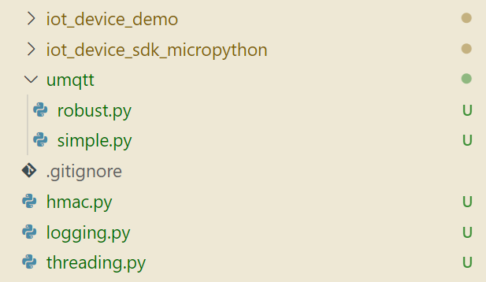

# iot-device-sdk-micropython 开发指南

# 目录

<!-- TOC -->

- [iot-device-sdk-micropython 开发指南](#iot-device-sdk-micropython-开发指南)
- [目录](#目录)
- [修订记录](#修订记录)
- [前言](#前言)
- [SDK简介](#sdk简介)
- [准备工作](#准备工作)
  - [micropython 的开发板](#micropython-的开发板)
  - [安装第三方库](#安装第三方库)
- [运行demo](#运行demo)


# 修订记录
1、支持核心客户端功能


# 前言
 本SDK基于MicroPython开发。MicroPython是Python 3编程语言的精简高效实现，它包含Python标准库的一小部分，经过优化后，可运行在微控制器和受限环境。同时Micropython在实现上尽可能贴近普通Python（CPython），已经有Python开发经验的用户可以快速上手；对于未使用过python的开发者，python也是一门极易学习的语言。

 相比传统的C/C++开发，MicroPython提供了灵活易用的语法，丰富的内置模块，内存管理；开发者可以聚焦于业务开发，极大地提升开发效率和体验。因此MicroPython适用于快速原型开发、验证，以及其它非计算密集的场景。

 本文将通过实例讲述iot-device-sdk-micropython（以下简称SDK）帮助设备用MQTT协议快速连接到华为物联网平台。

# SDK简介
SDK面向支持micropython的嵌入式终端设备，开发者通过调用SDK接口，便可实现设备与物联网平台的上下行通讯。SDK当前支持的功能有：
*  支持设备消息、属性上报、属性读写、命令下发
*  支持密码认证接入方式
*  支持自定义topic
*  支持设备影子查询

**SDK目录结构**

huaweicloud-iot-device-sdk-micropython
- iot_device_sdk_micropython: sdk核心包
- iot_device_demo/micro_message_sample.py: 示例


# 准备工作
##  micropython 的开发板
开发板需要适配`usocket`和`_thread`.

##  安装第三方库
sdk依赖于[`hmac`](https://github.com/micropython/micropython-lib/blob/master/python-stdlib/hmac/hmac.py)、`umqtt`、[`threading`](https://github.com/micropython/micropython-lib/blob/master/python-stdlib/threading/threading.py) 和[`logging`](https://github.com/micropython/micropython-lib/blob/master/python-stdlib/logging/logging.py)，点击对应的包名下载文件，然后后放到`iot_device_sdk_micropython`同级目录下。

如果缺少内置的`umqtt`，则需要下载 [`umqtt.simple`](https://github.com/micropython/micropython-lib/tree/master/micropython/umqtt.simple/umqtt) 和 [`umqtt.robust`](https://github.com/micropython/micropython-lib/blob/master/micropython/umqtt.robust/umqtt/robust.py), 在`iot_device_sdk_micropython`同级目录下新建一个`umqtt`文件夹，将下载好的`rboust.py`和`simple.py`放到`umqtt`文件夹下。



# 运行demo
```python
import usys
usys.path.append("/usr") # /usr更改成存放micropython sdk的根目录
import iot_device_demo.micro_message_sample
iot_device_demo.micro_message_sample.run()
```
